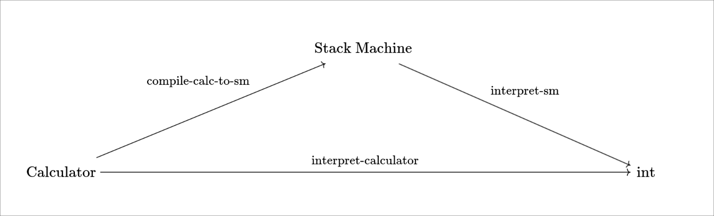
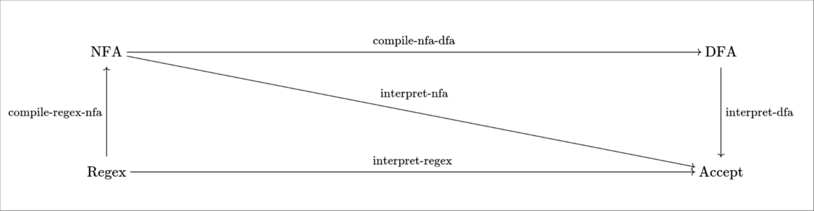

# CS160 Assignment 2

**Due: Monday, May 8th 11:59pm**

## Prerequisites
1. For this project, we'll need more dependencies from `opam`. Do:
    ```sh
    opam install ocamlgraph ppx_hash odoc
    ```

    before starting this project.

2. If you are on MacOS, make sure to install [Graphviz](https://graphviz.org/) if you haven't already. You can do so with brew:
    ```sh
    brew install graphviz
    ```
    On CSIL, Graphviz is already installed.


## Important Notes

1. For this assignment, *you are allowed to use any of the standard library functions from* `List`. You'll find `List.map`, `List.concat_map`, `List.fold_right` especially helpful.

2. Some of the functions in this assignment use *labeled arguments*. Make sure to read up on how [labeled arguments work in OCaml](https://dev.realworldocaml.org/variables-and-functions.html#labeled-arguments).

3. We have provided a lot of useful data structures and helper functions for this assignment, and have documented their expected usage. You can view the documentation by running `dune build @doc`, which will create HTML pages containing the documentation. The root of the documentation is contained in: `_build/default/_doc/_html/index.html`. You can use your favoraite web browser to open and navigate this page. If you are using CSIL, You can try opening that file in VS Code remote to open it in your browser. If that doesn't work, copy the entire `_build/default/_doc/_html` folder to your computer and try
opening that in your browser. Alternatively, you can view the documentation by reading the comments we wrote, which can be usually found in the correspoding OCaml signatures. We strongly advise you **not** to read the actual implementation of those signatures, since we used some advanced OCaml features and not-so-well documented third-party libraries. In case you have any questions about the stuff we provided, please don't hesitate to ask them on Slack!


## Prelude: What we talk about when we talk about programming languages

A programming language is made up of 3 parts:


1. **The Syntax** decides whether a string (i.e., a sequence of symbols) belongs to the language or not. For example, if you are in first grade doing arithmetic, or typing into a calculator, a *valid* syntax would look like:
   ```
   11 + 2
   ```
   An example of an *invalid* syntax would be:
   ```
   + 11 2
   ```
   Your syntax checker for the "normal" arithmetic would reject this syntax[^1]. Essentially, *syntax is how your programming language looks*.

   The part of the compiler that makes this kind of validity decisions is called a *parser*. In practice, in addition to outputting a yes/no answer, the parser also tranforms a valid string (aka *concrete* syntax) into a tree (aka *abstract* syntax) that is represented as some kind of tree-like data structures in memory. The abstract syntax is often called the *abstract syntax tree* (AST) due to its tree-like structure.
   
   In this assignment, you will only encounter abstract syntax, not concrete syntax. In the next assignment, you will implement a parser that transforms a program written in concrete sytntax to an abstract syntax tree.
   
   
2. **The Semantics** defines the *meaning* of your program. For example, the obvious meaning of the arithmetic expression `11 + 2` is: "evaluate the addition operation to obtain the integer value `13`". Although the meaning of `11 + 3` might seem painfully clear, we can perfectly give an alternative meaning of `11 + 2`, by interpreting it as adding hours in a 12 hour clock. In this interpretation, `11 + 2` will evaluate to the integer value `1`. In other words,the *semantics* of a program is orthogonal to its *syntax*, because we can give different semantics to the same piece of program.


3. **The Compiler**: Essentially, a compiler *translates* one
   language to another language. The second language is usually lower-level (i.e., closer to what the bare-metal CPU can understand) than the first language. 

   <!-- These are using Ocaml's [Functor](https://v2.ocaml.org/learn/tutorials/functors.html) feature (not to be confused with the general Category / CS notion of Functor. When this document mentions Functor, it refers to the Ocaml notion of Functor.) to define things like `Syntax`, `Program`, etc. We'll be dealing with Ocaml's Functor feature a lot in this project, so make sure to read up on it so you aren't confused. -->

These three components of a programming language is encapsulated into three *signatures* in [language.ml](./language.ml). In OCaml, signatures goes hand in hand with *modules*. A signature is like library APIs: it promises the existence of a set of types, values, and functions which can be freely used by the client of the library. A module, on the other hand, fulfills the promise of a signature by providing the required implementations of said types, values, and functions.

1. Let's look at the signature for the *syntax* of a programming language:

    ```ocaml
    module type Syntax = sig
    type program

    val show_program : program -> string
    (** Turn a program into a human-readable string. *)

    val pp_program : Format.formatter -> program -> unit
    (** Pretty-print a program. *)
    end
    ```

    This is essentially saying that, to implement a program's syntax, you must provide:

    - A type called `program` that represents the *abstract syntax tree* of your program. When implementing the `program` type for a programming language, the AST is usually represented using OCaml's algebraic data types, but other kinds of representations are possible, as we will see later in this assignment.

    - A `show_program` function that takes a `program` and turns it into a string.

    - A `pp_program` which is a pretty printer for the program type.


    The `Syntax` signature stipulates what a syntax of any language must provide. We can extend the `Syntax` signature to declare customized signatures for our own programming languages. For example, [calculator/sig.ml](./calculator/sig.ml) defines the `Syntax` signature for the calculator programming language:
    ```ocaml
    (* Calculator's syntax *)
    module type Syntax = sig
        type program =
        | Const of int
        | Add of program * program
        | Mul of program * program

        include Language.Syntax with type program := program
    end
    ```

1. For the `Sematics` component, we need:
    
    - The `program` type - the abstract syntax tree (AST) representation of our programming language.
    
    - The `interpret: input -> program -> output` function that takes the `input` to the program and the `program` and produces an `output`. This `interpret` function corresponds to the **semantics** of our program. Note that we generalize our previous notion of semantics by having the `interpret` takes a parameter of type `input`. This is because many programming languages allow the programs to manipulate some kind of state: for example, a Turing machine manipulates an infinite tape, a pushdown automaton manipulates a stack, and a C program manipulates your RAM, console, disk, network, etc.

3. For the `Compiler` we need:
    
    - The `program1` type - AST of the first program
    
    - The `program2` type - AST of the second program
    
    - The `compile: program1 -> program2` function that translates the first program into the second program.

Take a look at the rest of the [language.ml](./language.ml) and
[calculator/sig.ml](./calculator/sig.ml) to get a better understanding of the
signatures before starting the assignment.

## Part 1: Calculator

In this part of the assignment, you'll first implement the reference semantics for the calculator programming language. Although this semantics is relatively easy to understand, it is hard for machines to execute. Thus, you will next implement a compiler that translates calculator programs into stack machine programs. You only need to fill in the blanks in [`calculator/impl.ml`](./calculator/impl.ml).


**Problem 1 (5 pts).** Implement the reference semantics[^2] of the calculator programming language by completing the `interpret` function in the `Calc_ReferenceSemantics` module. This function takes the calculator syntax defined in [`calculator/sig.ml`](./calculator/sig.ml) and evaluates it into an integer.

**Problem 2 (5 pts).** The stack machine language is defined in [`calculator/sig.ml`](./calculator/sig.ml). A program in this language is a list of instructions of type `instr`:
    
```ocaml
type program = instr list
```

Each `instr` can be
- `Push <n>`, which pushes an integer constant onto the stack
- `Op Add2`, which pops two elements from the top of the stack and pushes their sum onto the stack
- `Op Mul2`, which pops two elements from the top of the stack and pushes their product onto the stack.

Implement the `interpret` function for the [stack machine](https://en.wikipedia.org/wiki/Stack_machine) language in the `SM_Semantics` module.

**Problem 3 (5 pts).** Implement a compiler from the calculator language to the stack machine language by completing the `compile` function in the `C2SM` module. You must ensure that your compiler is *correct* in the sense that the behavior of a compiled program matches the behavior of the original program. Specifically, you need to ensure that, in following diagram
    
    the two paths that go from Calculator to Int always produce the same answer. To test this, you can come up with a calculator program P, and compare the result of evaluating P using the reference semantics (`C_ReferenceSemantics`) with the result of evaluating the stack machine program compiled from P (the `CalculatorStackSemantics` module implements this "stack machine" semantics of calculator programs).

We included a few example test cases in [`test/test_calculator.ml`](./test/test_calculator.ml).


## Part 2. Regular Expressions

The regular expressions (regex) can be thought of as a programming language, parameterized by an alphabet. The meaning of a regex `r` is: given a sequence  of symbols from the alphabet, whether or not `r` matches the sequence. Syntactically, a regex program is built from the following constructs, which is also defined in [`regex/sig.ml`](./regex/sig.mli):
- `Void` matches nothing
- `Lit s` matches a literal symbol `s` from the alphabet
- `Cat (r1, r2)` matches the concatenation of `r1` and `r2`
- `Or (r1, r2)` matches either `r1` or `r2`
- `Star r` matches zero or more occurrences of `r`.

In this part of the assignment, you will implement the reference semantics for regex. However, you will quickly discover that although this semantics is relatively easy to understand, it suffers from abysmal performance due to the need for backtracking. To solve this problem, you will then implement an alternative semantics of regex by compiling it into NFA and then into DFA.

In short, you will implement the following diagram:


For the rest of the assignment, we assume the alphabet always contains the epsilon symbol. You can find the documentation for the alphabet signature in `<path-to-html>/regex/Regex/Alphabet/module-type-S/index.html` if you're viewing the documentation in a web browser.


**Problem 1 (5 pts).** In [`regex/syntax.ml`](./regex/syntax.ml), we gave a partial implementation of the `Notation` module, which defines helper functions to build more complex regex. The documentation for the `Notation` signature can be found in `<path-to-html>/regex/Regex/Sig/module-type-Syntax/Notation/index.html`. Your job is to implement the following *syntactic sugars* for regex in terms of previously defined functions in the `Notation` module:

```ocaml
val plus : program -> program
(** Matches one or more occurrences of r *)

val seq : program list -> program
(** Matches a sequence of regex *)

val alts : program list -> program
(** Matches some regex out of a list of alternatives *)
```

> **Hint:** For `seq` and `alts`, you may find `List.fold_right` helpful.


**Problem 2 (10 pts).** Complete the reference semantics of regex in [`regex/sem_reference.ml`](regex/sem_reference.ml). On a high level, the semantics is that a regex program is interpreted on an input sequence of symbols in the alphabet, aka a word, and returns an output of type `bool` that indicates whether the regex matches the word.

 ---
 Reference semantics are the canonical, and usually the most straightforward, to implement the semantics of a programming language. However, in the case of our regular expression reference semantics, **this is not the most efficient way**. As an exercise, try matching match `000` against `(0+0+)+1` using the reference semantics. You'll find that you'll get a segfault and run out of memory! This motivates the translation from the regex reference semantics to the more efficient NFA / DFA implementations. In the next few problems, you will implement an efficient semantics of regex by implementing two compilers: the first compiler translates regex into an equivalent NFA, and the second compiler translates an NFA into a DFA.
 
 You will only need to modify [`regex/sem_efficient.ml`](regex/sem_efficient.ml). Note that we have implemented libraries for representing NFA/DFA as transition graphs and utility functions that manipulate them. We will explain how to find the documentation and use those libraries in the next section.

**Problem 3 (10 pts).** To help you get some familiarity with using the transition graph library, implement the `interpret'` function in the `NFA` module. This function runs the NFA starting from the input state on the input word. The `interpret` function will call `interpret'` with the initial state as the input state. As an example, we implemented the `interpret'` and `interpret` functions for DFAs in the `DFA` module, which you may find helpful.

> **Hint:** You may find `List.exists` and `List.map` helpful.
   
**Problem 4 (10 pts).** Complete the `compile` function in module `Regex2NFA` that translates a regex into an equivalent NFA. You may find helpful to maintain the following invariants for the constructed NFAs:

1. There's exactly 1 initial state

2. There's exactly 1 accepting state
	   
**Problem 5  (10 pts).** Implement the `compile` function in module `NFA2DFA` that translates an NFA to a DFA.
> **Hint:** You may find `List.fold_*` and `fix` in [utils.ml](./utils.ml) helpful.


## Explanations for how to use the library functions

For the problems in part 2, you'll need to use the functions defined in [transition.ml](./regex/transition.ml). The main data structure that [transition.ml](./regex/transition.ml) defines is the Graph Functor:
```ocaml
(* excerpt from transition.ml *)
module Graph = struct
  module type S = sig
    type label
    (** State label type. *)

    type symbol
    (** Symbol type (transition label). *)
	
	(* ... things you won't have to be worried about rn *)
	(* ... signatures and documentation for the graph: *)
	
    val dfa_next : t -> state -> symbol -> state
    (** Assuming the input graph describes a DFA, 
    return the next state from the input state via the input symbol.
    Raise an exception if no transition is possible, or if there are multiple next states. *)
    val nfa_next : t -> state -> symbol -> state list
	(** Assuming the input graph describes an NFA,
    return the list of next states from the input state via the input symbol. *)
	
	(* ... more methods signatures here *)

  module Make (A : Alphabet.S) (Lab : Label.S) :
    S with type label = Lab.t and type symbol = A.t = struct
    type label = Lab.t
  (* ... implementations of the methods defined above *)
end
```

The comments starting with `...` are not in
[transition.ml](./regex/transition.ml) but are inserted for
illustrative purposes. This module might look scary, but I'll try to
explain the important parts. As you can see the `Graph` type is
*parameterized* by:
1. The `label` type - or the type for the label of the transition graph
2. The `symbol` type - or the type for the symbols for running the transition graph

The `Graph.Make` is what allows you to create a `Graph` with different
types. We can create a transition graph like:

```ocaml
module BinGraph = Graph.Make (Binary) (Label.Int);;
```

This uses `Graph.Make` to create a *new module* called `BinGraph`.
`BinGraph` is a transition `Graph` that is parameterized by the
`Binary` alphabet (see: [alphabet.ml](./regex/alphabet.ml) ) and the
`Int` label (which is defined in
[transition.ml](./regex/transition.ml) ). To create new states and add
transitions, you can look at the function definitions for graph in
[transition.ml](./regex/transition.ml), here's an example:
```ocaml
let fresh_state ~init ~accept = BinGraph.State.create (Counter.next ()) ~init ~accept;;
let fresh_init () = fresh_state ~init:true ~accept:false;;

let one_state =
  let
    s0 = (fresh_init ())
  in
  BinGraph.add_state empty_graph s0
```

You can find the complete example and other examples in
[examples.ml](./regex/examples.ml).


In the DFA code, we have:
```ocaml
module DFA = struct
  module Make (A : Alphabet.S) (Lab : Label.S) = struct
    module Graph = Graph.Make (A) (Lab)
	type state = Graph.state
    type symbol = A.t
    type output' = symbol list list
    type input' = state * symbol list
    type program = Graph.t
	(* ... *)
	end
end
```
This is because DFA is a [Functor](https://v2.ocaml.org/learn/tutorials/functors.html) as well! 
Thus, DFA's transition graph (the `module Graph = Graph.Make (A) (Lab)` part) is parameterized by the arguments you give to `DFA.Make`. To try out the DFA on a concrete alphabet and label,  you need to do:
```ocaml
module MyBinDFA = DFA.Make (Binary) (Label.Int)
(* try out the DFA functions here *)
```


To get a better understanding of how this works, look at the [examples](./test/examples.ml) (or ./test/examples.ml ). To load the examples into utop, you can do:
```sh
dune utop
```

Then in the utop prompt:
```
utop # open Examples;;
utop # my_output;;
- : string = "false"
utop # h ();;
```

The `my_output` constant stores the output of running the example
input on an example_program. This is `false` because our interpret DFA
outputs booleans. The `h ()` function saves a picture of the example
graph to the `hw2` folder, with the name `graph<hex>.png`. Feel free
to modify the `examples.ml` file and play with it in the interpreter.
Also, if you want / need to experiment with your NFA code for
debugging, feel free to use the `examples.ml` module for writing that
code(like for printing an example png).

## Testing

Example test cases for part 1 and part 2 can be found in [test/test_calculator.ml](./test/test_calculator.ml) and [test/test_regex.ml](./test/test_regex.ml), respectively. You can run all tests with `dune runtest`.


## Submission

TBD


[^1]: Even though this expression is valid in [Polish Notation](https://en.wikipedia.org/wiki/Polish_notation).


[^2]: This semantics is called the "Reference Semantics" as there are often many ways to implement a
program's semantics (as you'll see), but in order to keep the
semantics of a programming language consistent, the language
authors often provides a "Reference Semantics" implementation of
their programming language. For example, [CPython](https://github.com/python/cpython) is the *reference implementation* of Python, and [Micropython](https://github.com/micropython/micropython) is an implementation of *Python's sematics* that is optimized for microcontrollers.
