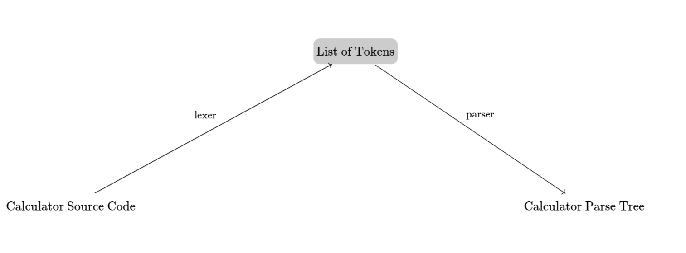
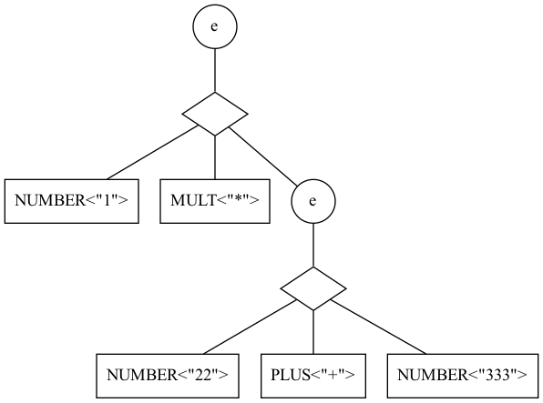

# CS160 Assignment 3

Due: Monday May 22 11:59PM

This assignment has two parts. In Part 1, you will write a parser for the calculator language. In Part 2, you will use an existing lexer/parser generator to specify the grammar for the Patina programming language, for which you'll be writing a complete compiler in this and future assignments!

Click [this link](https://download-directory.github.io/?url=https%3A%2F%2Fgithub.com%2Ffredfeng%2FCS160%2Ftree%2Fmain%2Fassignments%2Fhw3) to download the homework.

## Part 1: Parsing the Calculator Language

> Directory: [part1/](./part1/)

In this part of the assignment, you'll be parsing a simple calculator language made up of natural number constants, additions, multiplications, and parenthesized expressions.

To do this, you'll first be using the regex language to specify a *lexer*, which, when given a calculator source program as a string, will divide the string into a list of *tokens*. Then, you'll implement a parser for the calculator
syntax specified using context-free grammar.

In summary, you'll implement the following diagram: 

### Submission: TBD

### Problem 1: Lexer Specification (3 Points)

> File: [part1/mylexer.ml](./part1/mylexer.ml)

To specify the lexer for a programming language $L$, we provide a list of *rules*. Each rule maps a *kind* of token to a regular expression that matches said kind of token.

The calculator language has the following kinds of tokens:

- `NUMBER`, which matches any natural number literals

- `PLUS`, which matches the `+` symbol

- `MULT`, which matches the `*` symbol

- `LPAREN`, which matches the `(` symbol

- `RPAREN`, which matches the `)` symbol

- `WHITESPACE`, which matches spaces, tabs, and newlines but matched tokens will be omitted in the output token list

We have implemented the lexer in the `Make` modules. The `lex` function takes a list of rules and divides an input string into a list of tokens according to the rules. Each token in the output has the type

```ocaml
type token = {kind: string; value: string}
```
where `kind` is the kind of the token and `value` is the substring matched by the regex associated with said kind of token. We write a token as "`kind`\<`value`\>". For example, if the input string is `1 * ( 22 + 333 )`, then the lexer should return the following list of tokens
```ocaml
NUMBER<"1">
MULT<"*">
LPAREN<"(">
NUMBER<"22">
PLUS<"+">
NUMBER<"333">
RPAREN<")">
```

Your job is to provide the corresponding regular expression for each kind of token by replacing each `todo ()` in the definition `rules` with a `Regex.program`, which can be defined using `Regex.Notation` that you've seen in hw2:
```ocaml
let rules : rules =
  from_list
    [
      ((dummy number).kind, todo (), true);
      ((dummy plus).kind, todo (), true);
      ((dummy mult).kind, todo (), true);
      ((dummy lparen).kind, todo (), true);
      ((dummy rparen).kind, todo (), true);
      ((dummy whitespace).kind, todo (), false);
    ]
```

The last boolean indicates whether the token should be omitted in the output. Here, we omit whitespace characters.

Because our lexer relies on the semantics of regex, you need to copy over your `sem_reference.ml` in order for the lexer to work. As a consequence, the correctness of the lexer depends on the correctness of the reference semantics implemented. If your `sem_reference.ml` is buggy, your local test for this problem might fail. But in the autograder, we will instantiate the lexer with the solution reference semantics.


The file `test_lexer.ml` contains some example tests for this problem.


### Problem 2: Context-Free Grammar as a Programming Language (2 Points)

> File: [part1/myparser.ml](./part1/myparser.ml)
>
> Module: Make.Notation

A context-free grammar (CFG) can be thought of as a programming language consisting of a set of *productions* and a distinguished non-terminal variable called the *start*.

The productions map $x$ -- a string representing a non-terminal variable -- to $e$, an *expression* that $x$ can be expanded into. An expression can be one of the following:
- a terminal `token`
- a non-terminal variable represented by a `string`
- a list of alternative expressions
- a sequence of expressions

The semantics of expressions simply matches a list of tokens `ts` against an expression `e`:
- if `e` is a terminal `tk`, then `ts` must be a list containing only `tk`
- if `e` is a non-terminal `nt`, then we match `ts` against the production associated with `nt`
- if `e` is an list of alternatives `e1`, `e2`, ..., `en`, then `e` matches `ts` if any of `e1`, `e2`, ..., `en` matches `ts`
- if `e` is a sequence `e1`, `e2`, ..., `en`, then `e` matches `ts` if we can split `ts` into `ts1`, `ts2`, ..., `tsn` such that `e1` matches `ts1`, `e2` matches `ts2`, ..., and `en` matches `tsn`.

For example, the following is a possible grammar for the calculator language:
```
start : e
e --> NUMBER | e PLUS e | e MULT e | LPAREN e RPAREN
```

Then `e` matches the list `NUMBER<"1"> PLUS<"+"> NUMBER<"2">` using the following derivation:
```
e 
---> e PLUS<"+"> e
---> NUMBER<"1"> PLUS<"+"> e
---> NUMBER<"1"> PLUS<"+"> NUMBER<"2">
```

This encoding of CFG is formalized in [part1/myparser.ml](./part1/myparser.ml):

- We define expressions as

    ```ocaml
    type expr =
        | Term of token  (** Terminal *)
        | Nonterm of nonterm  (** Non-terminal *)
        | Alts of expr list  (** Alternatives *)
        | Seq of expr list  (** Sequence *)
    ```
    where `nonterm` is defined to be `string`

- Productions are represented as a map from `string` to `expr`.

    ```ocaml
    module Prod = Map.Make (String)
    type productions = expr Prod.t
    ```

- A grammar is simply a set of productions together with a start:
    ```ocaml
    type grammar = { start : nonterm; ps : productions }
    ```

Similar to regex, we define a `Notation` module that contains functions for building more complex expressions.
```ocaml
  module Notation = struct
    (** Make a terminal token *)
    let t tk = Term tk

    (** Make a non-terminal string *)
    let nt s = Nonterm s

    (** Make a sequence *)
    let seq es = Seq es

    (** Make a list of alternatives *)
    let alts es = Alts es

    (** Cat *)
    let ( <*> ) e1 e2 = todo ()

    (** Or *)
    let ( <|> ) e1 e2 = todo ()

    (** Epsilon *)
    let epsilon = todo ()

    (** Void *)
    let void = todo ()
  end
```

Your job is to provide the definitions for `Cat`, `Or`, `Epsilon` and `Void` using `seq` or `alts`:
- `Cat (e1, e2)` matches `ts` if `ts` can be split into two halves, matched by `e1` and `e2` respectively
- `Or (e1, e2)` matches `ts` if either `e1` or `e2` matches `ts`
- `Epsilon` matches the empty list of token
- `Void` matches nothing


### Problem 3: Accept Semantics of CFG (5 Points)

> File: [part1/myparser.ml](./part1/myparser.ml)
>
> Module: Make.AcceptSemantics

Given a context-free `grammar`, we can determine whether an input list of tokens belongs to the grammar or not. The `AcceptSemantics` module implements this semantics of CFG in the `interpret` function:
```ocaml
type input = token list [@@deriving show]
type output = bool
...
let interpret (g : grammar) (ts : input) : output =
...
```
The `interpret` function calls `interpret'` on the rule associated with the start variable of the grammar.

We make, however, one small optimization: to eliminate the non-determinism from having to guess where to split the input tokens in the `Seq` case, `interpret'` consumes the input as much as possible by expanding the current expression, and returns a list of unconsumed parts of the input:
```ocaml
type output' = input list

let rec interpret' (ps : productions) (e : expr) (ts : input) : output' =
...
```
That is, `interpret'` will output a list that represent all possible ways in which some prefix of the input can be parsed. Each item of the output list has type `input` and is some postfix of `ts` that has not been consumed by interpreting expression `e`.

For example, if `e` is `PLUS <|> (PLUS <*> MULT)`, and `ts` is `PLUS<"+"> MULT<"*"> NUMBER<"123"> NUMBER<"456">`, then calling `interpret'` will return
```ocaml
[
    [ MULT<"*">; NUMBER<"123">; NUMBER<"456"> ];
    [ NUMBER<"123">; NUMBER<"456"> ]
]
```
Because `e` can either match `PLUS`, in which case the unconsumed part of the input is `MULT<"*"> NUMBER<"123"> NUMBER<"456">`, or it can match `PLUS <*> MULT`, in which case the unconsumed part of the input is `NUMBER<"123"> NUMBER<"456">`.

Finally, `interpret` filters the results of `interpret'` by checking whether there exists at least one way of parsing the input that consumes all tokens --- equivalently, there is some way of parsing the input that leaves no token unconsumed.

Your task is to complete the implementation of `interpret'`. Your parser should perform [left-to-right, leftmost](https://en.wikipedia.org/wiki/LL_parser) (LL) derivations.

#### Testing

We have implemented three candidate grammars for the calculator language in the `Calc` module:
1. `grammar_rec` is the naive grammar:
    
    ```
    start : e
    e --> NUMBER | e PLUS e | e MULT e | LPAREN e RPAREN
    ```

    It is [left-recursive](https://en.wikipedia.org/wiki/Left_recursion), which means your LL parser will inevitably enter infinite recursion when attempting to parse a non-trivial calculator expression.

2. `grammar_amb` removes the left-recursion from `grammar_rec` following the [standard recipe](https://en.wikipedia.org/wiki/Left_recursion#Removing_recursion):
    
    ```
    start : e
    e  --> NUMBER | NUMBER e' | LPAREN e RPAREN
    e' --> PLUS e e' | MULT e e' | epsilon
    ```

    However, this grammar is still ambiguous in that there may be multiple derivations for certain input strings. E.g., `1 + 22 * 333` can be parsed as either `1 + (22 * 333)` or `(1 + 22) * 333`. This is okay because `interpret` will accept the string if at least one derivation exists.

3. `grammar` is the deterministic grammar for the calculator language:
    
    ```
    start : e
    e --> t | t + e
    t --> f | f * t
    f --> NUMBER | LPAREN e RPAREN
    ```
    It is deterministic in the sense that any valid calculator expression can be parsed in one and only one way.

The file `test_parser.ml` contains some example tests for this problem. Note that although we call `lex` to first lex the input string into a token list, you can manually provide the token list instead in case `lex` doesn't work correctly (due to a buggy regex semantics, for example).


### Problem 4: Tree Semantics of CFG (Bonus, 5 Points)

> File: [part1/myparser.ml](./part1/myparser.ml)
>
> Module: Make.TreeSemantics

> ⭐ This is a **bonus** problem.

The accept semantics is of theoretical interest, but has less pratical use. In reality, we want the parser to turn a list of input tokens into a list *parse trees* that correspond to derivations of the input (from which we can construct abstract syntax trees with a bit of massaging). For example, given the following list of tokens
```ocaml
NUMBER<"1">
MULT<"*">
NUMBER<"22">
PLUS<"+">
NUMBER<"333">
```

We not only want to confirm that it belongs to our grammar, but would like to visualize the process in which the parser arrived at the "accept"/"reject" answer. Derivations capture exactly this process, but they can be further condensed into trees. For example, consider the following derivation of `NUMBER<"1"> MULT<"*"> NUMBER<"22"> PLUS<"+"> NUMBER<"333">` using the naive calculator grammar:
```
e 
---> e MULT<"*"> e
---> NUMBER<"1"> MULT<"*"> e
---> NUMBER<"1"> MULT<"*"> e PLUS<"+"> e
---> NUMBER<"1"> MULT<"*"> NUMBER<"22"> PLUS<"+"> e
---> NUMBER<"1"> MULT<"*"> NUMBER<"22"> PLUS<"+"> NUMBER<"333">
```

This derivation can be concisely represented using the following parse tree:



where a circle node represents an expansion of a non-terminal in the derivation, a diamond represents a sequence, and a box represents a token.

In OCaml, we represent parse trees as

```ocaml
type parse_tree = Node of nonterm * parse_tree | Leaf of token | Seq of parse_tree list
```

The tree semantics of CFG returns all parse trees that correspond to derivations of the input.

```ocaml
type input = token list
type output = parse_tree list
let interpret (g : grammar) (ts : input) : output =
...
```

Similar to the accept semamtics, we define `interpret'` that returns a list of (partial parse tree, unconsumed input) pairs:
```ocaml
type output' = (parse_tree * input) list
let rec interpret' (ps : productions) (e : expr) (ts : input) : output' =
...
```
and have `interpret` to filter the parse trees returned by `interpret'` that fully consume the input.

Your job is to complete the definition of `interpret'`.

#### Testing

In `Calc`, we implemented `visualize_parse_trees` which takes an input string, and prints the textual representation of all parse trees and saves the corresponding Graphviz & PNG files which you can inspect.

You can use the grammars from the previous problem to test your implementation.


## Part 2: Parsing Patina (10 Points)

> Directory: [part2/](./part2/)

### Submission: TBD

In this part, you'll be getting familiar with the [Patina](https://junrui-liu.github.io/patina/overview/overview.html) programming language, for which you'll be writing a complete compiler.

You will use OCaml's *parser generator*, [ocamllex/ocamlyacc](https://v2.ocaml.org/manual/lexyacc.html) to parse Patina programs using the [reference grammar](https://junrui-liu.github.io/patina/ref.html).

A parser generator takes the grammatical specification of the target language and produces a pair of lexer and parser. OCaml's parser generator is based on [Yacc](https://en.wikipedia.org/wiki/Yacc), which is originally a parser generator from the 1970s but has greatly influenced all modern-day parser generators. Yacc is also similar to [Bison](https://en.wikipedia.org/wiki/GNU_Bison), so any documentation / tutorials you can find in this parser generator family will be useful (although you might have to translate the syntax / concepts to OCaml).

### Problem 1: Hello Patina

You will write some simple programs in the Patina language. We'll provide you with a prototype interpreter for you to validate your programs. Be aware that the prototype is quite crappy; by the end of this course will have a compiler that's much better than ours. You can access the interpreter on CSIL at `~junrui/patina`. Run it with `~junrui/patina -i <patina-source-file>`.

For each of these, we recommend looking at the [syntax reference](https://junrui-liu.github.io/patina/ref.html#concrete-syntax) of Patina, as well as the [overview](https://junrui-liu.github.io/patina/overview/overview.html) of the Patina language. They should contain all the information that is necessary to complete the assignments. For anything that's unclear after that, ask on Slack!

1. Write a simple function to practice the oddities of Patina syntax. This function should take an int as argument, create an array with length equal to the integer, fill it with 7s, and then return it. The main function should call this function with 3 as its input and print out the 2nd value in the result.

2. Write a function that takes in an integer and returns whether or not the integer is a perfect number. You can do so by creating a list of all the factors of the input integer, and then sums them together to check whether a number is perfect or not, returning `true` if it is and `false` otherwise.

    In your `main` function, use a while loop to print out perfect numbers up to 1000, each on a new line. For example, if your source file is named `perfect.pt`, then running `patina -i perfect.pt` should output
    ```
    6
    28
    496
    ```


## Problem 2: Lexer

> File: [part2/scanner.mll](./part2/scanner.mll)

The first step of a compiler is splitting the string of the whole code into pieces which represent all of the important parts.

OCaml has the very useful tool for doing lexing of `ocamllex`, which takes a definition of a mapping from token strings to tokens, and produces an automaton that can actually do the lexing, in a way similar to the efficient semantics of regex in hw2 and the lexer in part 1 of this hw.

Each of the lines of code will look something like:
```
  | '/'  { DIV }         
```

Each of these tokens is atomic for the purpose of parsing - it can't be divided further without losing some utility. For example, you don't want to make each digit in an integer a separate token, because you'd have to put them all together when parsing any case where they're used. On the other hand, you wouldn't want to count "(2" as a token, because that parenthesis is going to work just as any other parenthesis in the problem.

Fill out the rows of your template `scanner.mll` file to write a lexer for Patina's full syntax.

## Problem 3: Parser

> File: [part2/parser.mly](./part2/parser.mly)

`ocamlyacc` is a tool which automatically generates a parser for a language given a grammar specification. You will use it to parse textual file containing Patina programs into their *abstract syntax tree* representation.

Each line of the parser should be inside of a block defining a non-terminal or terminal symbol, and should include both the symbols that make it up on the left, as well as OCaml code (using the constructors of the AST) which represents the value on the right. This value is _not_ the result of interpretation of the code; it simply builds up the AST, so no calculation or interpretation should be done.

For example, to say that an expression formed by two sub-expressions separated by the `DIV` token, we write
```
expr:
    ...
    | expr DIV expr      { Binary(Div, $1,$3) }
```

We have defined an abstract syntax tree (AST) type for you in `ast.ml`, but it's up to you do define the intermediate nodes of parsing. You can use the patina concrete reference not only as a reference of how Patina code looks, but also as hints for what parsing structure to use.

Modify the template `parser.mly` to write a parser for Patina's full syntax. Specifically, you will need to add three kinds of stuff:

1. Since the parser is connected to the lexer your wrote for Part 2, you need to declare in the parser file the tokens you defined in the lexer:
      ```
      %token // TODO: Your tokens here
      ```

2. Define your grammar rules:
      ```
      // TODO: Your rules here E.g.
      ```

3. Your grammar will likely be ambiguous (i.e. there will be shift/reduce or even reduce/reduce conflicts). You can resolve a lot of ambiguities by simply specifying the [precedence and associativity](https://ocaml.org/manual/lexyacc.html#ss:ocamlyacc-declarations) of the elements in your grammar:
      ```
      // TODO: Your associativity rules here
      ```
