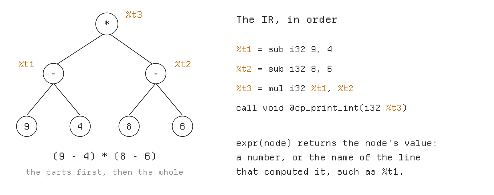
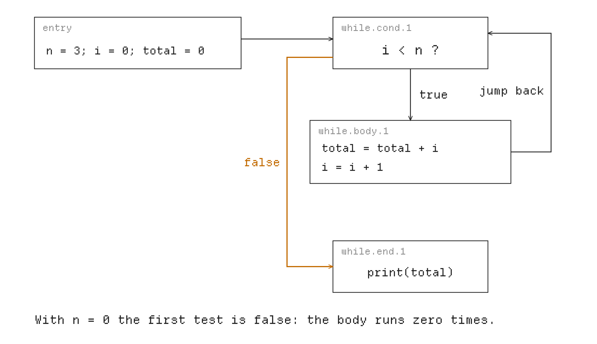

# PA1: Compiling Expressions, Variables and Loops to LLVM IR

*Where does each value go?*

**Due: Friday, October 9, 11:59 pm (Pacific).** Released Wednesday, September 30.

**What to do:** complete **Exercises 1 to 4** in `compiler/codegen.py`, and write **three tests** of your own. Hand in your AI sessions, a design document in `docs/pa1-design.md`, or both. Section 8 says how to hand them in.

**Lectures:** Your first compiler (9/30), Variables and control flow (10/5), Testing your compiler (10/7).

This quarter you write a compiler, in Python. A compiler translates a program into a form the computer can run. Yours translates ChocoPy, a small part of Python, into **LLVM IR**, a simple language close to machine code; a tool called `clang` then turns the IR into a program you can run.

In PA1, Python reads the ChocoPy program for you and describes it as a tree. **Your compiler turns that tree into LLVM IR that does what the program says.** Take this program:

```python
print((9 - 4) * (8 - 6))
```

It prints `10`. The IR your compiler writes for it computes `9 - 4`, then `8 - 6`, then multiplies the two.

## 1 Getting started

### 1.1 Setup

Get PA1's starter code as in PA0, with the first two commands of PA1's OneWorld page, which staff send you. The first installs or updates the command line. The second joins PA1: it downloads the starter code into a new folder, a git repository of its own, and leaves you there. The third, `oneworld assessment submit`, hands PA1 in (Section 8).

```sh
curl -fsSL https://downloads.oneworldai.com/oneworld-cli/install.sh | sh   # step 1
oneworld assessment join <PA1 invite code>                                 # step 2
```

**Work in this folder until you hand PA1 in:** OneWorld hands in what you change in it and the sessions you start in it. You no longer need your PA0 folder.

**Your code goes in `compiler/codegen.py`.** The other files you need:

| File | What it is |
|---|---|
| `test/mine/pa1/` | your own test programs |
| `docs/pa1-design.md` | a short description of your design, if you hand one in |
| `compiler/emit.py` | helpers for writing IR (Section 3.3) |
| `runtime/runtime.c` | C functions your IR calls, for example to print a number |
| `test/pa1/` | 35 test programs |

Type commands in a terminal, in your PA1 folder:

```sh
python3 -m compiler run prog.py      # compile prog.py and run the result
python3 -m compiler ll prog.py       # show the IR your compiler writes
python3 -m compiler ast prog.py      # show the tree Python builds for the program
python3 tools/difftest.py test/pa1   # run the tests
make test-pa1                        # run all PA1 tests, including yours
```

Keep your own experiments in the folder `scratch/`, which git ignores. In the examples, a line that starts with `$` is a command you type, and the lines after it are what it prints.

### 1.2 ChocoPy in PA1

PA1 programs use only this part of ChocoPy:

- **Variables** are declared at the top, with a type and a starting value: `x: int = 5`, `done: bool = False`. The starting value is a plain number, `True` or `False`; `x: int = -5` is not allowed (write `x: int = 0`, then `x = -5`).
- **Statements:** assignment (`x = x + 1`), `print` of one number or Boolean, `if`/`elif`/`else`, `while` and `pass`.
- **Expressions:** numbers, `True`, `False`, variables, `-x`, `not x`, `+`, `-`, `*`, `//`, `%`, `<`, `<=`, `>`, `>=`, `==`, `!=`, `and`, `or`, and `a if c else b`.

The test programs have no type errors, and their numbers never go outside the 32-bit range. In LLVM, ChocoPy's `int` is written `i32` (a 32-bit integer) and `bool` is written `i1` (a single bit, `true` or `false`). The [course's ChocoPy page](https://github.com/fredfeng/CS160/blob/main/chocopy/SPEC.md) describes the whole language.

### 1.3 Your code

You write three methods of the class `CodeGen` in `compiler/codegen.py`. Its method `program`, which the starter provides, calls them in order for each declaration and statement at the top level of the program, and puts all the IR they write into one function, `@main`; leave it as it is. Inside your methods, `if` and `while` call `self.statement` on each statement of their body, and an operation calls `self.expr` on its parts.

- `declaration`, for a variable declaration such as `x: int = 5`;
- `statement`, for a statement such as `x = x + 1` or `while x > 0:`;
- `expr`, for an expression such as `x + 1`.

This is the class in `compiler/codegen.py`, shortened: the comments above each method are left out, and `...` stands for code the starter already has. Fill in the methods in that file; nothing needs replacing.

```python
class CodeGen:
    def __init__(self):
        self.module = Module()
        self.fn = Function("define i32 @main()")
        # TODO(student): You can modify or remove these member variables as you like.
        # ChocoPy variable name -> (slot, ChocoPy type), e.g. "x" -> ("%x.addr", "int")
        self.variables: dict[str, tuple[str, str]] = {}

    def program(self, tree: ast.Module) -> str:
        for node in tree.body:
            if isinstance(node, ast.AnnAssign):
                self.declaration(node)
            else:
                self.statement(node)
        self.module.add_function(self.fn.render("ret i32 0"))
        return self.module.render()

    def declaration(self, node: ast.AnnAssign) -> None:
        raise NotImplementedError("CodeGen.declaration is not implemented.")

    def statement(self, node: ast.stmt) -> None:
        ...  # handles expression statements and pass

    def expr(self, node: ast.expr) -> tuple[str, str]:
        ...  # handles integer literals and print of an int
        raise NotImplementedError(f"CodeGen.expr is not implemented for {type(node).__name__}.")
```

**`expr` returns two things:** the expression's value as IR writes it (a number such as `5`, `true`, or a name such as `%t3` that holds a result computed earlier), and its type, `"int"` or `"bool"`. Until you handle a kind of expression, the starter stops and names it:

```text
$ python3 -m compiler run test/pa1/product.py
test/pa1/product.py: CodeGen.expr is not implemented for BinOp.
```

## 2 Testing your compiler

Python already knows the right output of every test program. The tester, `tools/difftest.py`, runs each program twice, once with Python (which it calls CPython) and once with your compiler, and compares what they print. **The output must be exactly the same, and if Python stops with an error, your program must stop with an error too.**

```text
$ python3 tools/difftest.py test/pa1/product.py
FAIL     test/pa1/product.py
         does not compile: test/pa1/product.py: CodeGen.expr is not implemented for BinOp.

0/1 tests passed
```

Each test ends with **`ok`**, the same output as Python; **`FAIL`**, with the next line saying what differs, for example `output line 2: expected '-4', got '-3'`; **`TIMEOUT`**, when it ran for more than 10 seconds, as an endless loop does; or **`BAD TEST`**, when the test program itself is wrong.

**To write a test,** put a ChocoPy program in `test/mine/pa1/`. Special comments, on any line, say what Python cannot check:

| Comment | Meaning |
|---|---|
| `# expect-exit: 2` | the program must stop with exit code 2 (and Python must stop with an error too) |
| `# ir-has: TEXT` | your IR must contain this pattern (a Python regular expression) |
| `# ir-lacks: TEXT` | your IR must not contain it |
| `# ir-count: TEXT N` | your IR must contain it exactly N times |
| `# cpython-differs` | do not run Python; the `# expect-stdout: LINE` comments give the expected output |

A test that must stop with an error needs an `# expect-exit` line; without one, the tester reports `BAD TEST`. The `ir-` patterns are searched in everything `python3 -m compiler ll` prints, the `declare` lines included, and `( ) . * + [` have special meanings in them: put a `\` before one to match it as it is, as in `# ir-has: cp_print_int\(i32 42\)`.

```python
# Prints 7, then stops with "Division by zero" (exit code 2).
# expect-exit: 2
x: int = 0
print(7)
print(7 // x)
```

**If clang refuses your IR,** the tester shows clang's first error, such as `IR line 18:32: error: '%t2' defined with type 'i1' but expected 'i32'`; line 18 is a line of what `python3 -m compiler ll` prints. `python3 -m compiler run` shows the whole message.

**On a Mac,** clang accepts some broken IR, for example a name used in a block that can be reached without passing the line that defines it. `--verify` checks your IR strictly: `python3 tools/difftest.py --verify test/pa1`.

To run a program by hand and see how it ended (`echo $?` prints 0 when it ended normally):

```sh
python3 -m compiler build scratch/prog.py -o scratch/prog
./scratch/prog; echo $?
```

## 3 Background

### 3.1 The tree

Python turns a program into a tree. Each part of the program becomes a node, and the smaller parts inside it become its children. This is the tree of `print((9 - 4) * (8 - 6))`:

```text
$ python3 -m compiler ast test/pa1/product.py
Module(
  body=[
    Expr(
      value=Call(
        func=Name(id='print', ctx=Load()),
        args=[
          BinOp(
            left=BinOp(
              left=Constant(value=9),
              op=Sub(),
              right=Constant(value=4)),
            op=Mult(),
            right=BinOp(
              left=Constant(value=8),
              op=Sub(),
              right=Constant(value=6)))],
        keywords=[]))],
  type_ignores=[])
```

A `BinOp` is an operation with two sides, such as `9 - 4`: `left` and `right` are the two sides and `op` is the operation. Your code checks what kind of node it has with `isinstance`, for example `isinstance(node, ast.BinOp)`. Python counts `True` and `False` as numbers too, so check `type(node.value) is bool` before treating a value as a number. The nodes of PA1:

| Node | Example | What it holds |
|---|---|---|
| `AnnAssign` | `x: int = 5` | `target.id`, `annotation.id`, `value` |
| `Assign` | `x = x - 1` | `targets[0].id`, `value` |
| `Expr` | `print(x)` | `value` |
| `If` | `if`/`elif`/`else` | `test`, `body`, `orelse` (the `else` part) |
| `While` | `while x > 0:` | `test`, `body` |
| `Pass` | `pass` | nothing |
| `Constant` | `5`, `True` | `value` |
| `Name` | `x` | `id` |
| `UnaryOp` | `-x`, `not b` | `op` (`USub()`, `Not()`), `operand` |
| `BinOp` | `a + b` | `left`, `op` (`Add()`, `Sub()`, `Mult()`, `FloorDiv()`, `Mod()`), `right` |
| `Compare` | `a < b` | `left`, `ops[0]` (`Lt()`, `LtE()`, `Gt()`, `GtE()`, `Eq()`, `NotEq()`), `comparators[0]` |
| `BoolOp` | `a and b` | `op` (`And()`, `Or()`), `values` (two or more) |
| `IfExp` | `a if c else b` | `test`, `body`, `orelse` |
| `Call` | `print(e)` | `func.id`, `args[0]` |

### 3.2 LLVM IR

This is everything your compiler writes for `print(160)`:

```llvm
; Generated by the CS160 ChocoPy compiler

declare void @cp_print_int(i32)
declare void @cp_print_bool(i32)
declare void @cp_print_str(ptr)
declare ptr @cp_alloc(i64)
declare i32 @cp_str_eq(ptr, ptr)
declare void @cp_error_arg()
declare void @cp_error_div()
declare void @cp_error_oob()
declare void @cp_error_none()
declare void @llvm.memcpy.p0.p0.i64(ptr, ptr, i64, i1)

define i32 @main() {
entry:
  call void @cp_print_int(i32 160)
  ret i32 0
}
```

- The `declare` lines list the C functions a program may call. The examples below leave them out.
- **Each line inside `@main` is one small step.** A step that computes a value gives it a new name: `%t1 = sub i32 9, 4` computes `9 - 4` and calls the result `%t1`. **Each name gets its value once and never changes.**
- **The code is divided into blocks.** A block starts with a label, such as `entry:`, and ends with exactly one jump (`br`) to another block, or with `ret`, which ends the program. A block that calls the division-by-zero error never finishes, so it ends with `unreachable`.
- **A variable is kept in memory:** `alloca` reserves space for it, `store` writes a value there, and `load` reads it back. `ptr` is the type of a memory address.

| IR | Example | What it does |
|---|---|---|
| `add`, `sub`, `mul` | `%t3 = mul i32 %t1, %t2` | add, subtract, multiply |
| `sdiv`, `srem` | `%t3 = sdiv i32 %t1, 2` | divide and take the remainder, dropping any fraction |
| `icmp` | `%t2 = icmp slt i32 %t1, 2` | compare: `eq` (equal), `ne`, `slt` (less than), `sle`, `sgt`, `sge`; the answer is `true` or `false` |
| `xor`, `and` | `%t2 = xor i1 %t1, true` | logic on bits; `xor` with `true` flips a Boolean |
| `zext`, `sext` | `%t3 = zext i1 %t2 to i32` | turn a Boolean into a number: `zext` gives 1 for `true`, `sext` gives -1 |
| `select` | `%t4 = select i1 %t3, i32 %b, i32 0` | `%b` if `%t3` is `true`, otherwise `0` |
| `alloca`, `store`, `load` | `%t1 = load i32, ptr %x.addr` | reserve, write and read a variable's memory |
| `call` | `call void @cp_print_int(i32 %t3)` | call a function |
| `br`, `ret`, `unreachable` | `br i1 %c, label %a, label %b` | jump to `a` if `%c` is `true`, else to `b`; end the program; end a block that never finishes |

The [LLVM Language Reference](https://llvm.org/docs/LangRef.html) describes every instruction.

### 3.3 Writing IR

Your code writes IR with these helpers of `self.fn`:

| Helper | What it does |
|---|---|
| `self.fn.temp()` | gives a new name for a result: `'%t1'`, then `'%t2'`, and so on |
| `self.fn.labels("if.then", "if.end")` | gives new block labels with the same number: `['if.then.1', 'if.end.1']` |
| `self.fn.slot("x", "i32")` | reserves memory for the variable `x` and returns its address, `'%x.addr'`; you can call it anywhere, since the `alloca` always goes into the `entry` block |
| `self.fn.emit(text)` | adds one line of IR |
| `self.fn.label(name)` | starts a new block, first adding a jump to it if the previous block has none |

**`self.fn.label` only adds a jump to the block it starts.** At the end of a block that must jump somewhere else, such as the end of `if.then.N`, which jumps to `if.end.N`, write the `br` yourself; otherwise the program falls into the next block, and no tool reports it.

This, for example, compiles `a + b`:

```python
left, _ = self.expr(node.left)
right, _ = self.expr(node.right)
result = self.fn.temp()
self.fn.emit(f"{result} = add i32 {left}, {right}")
return result, "int"
```

Your numbers may differ from this handout's: the tests check only what your program prints.

## 4 Expressions and `print`

**To compile an operation such as `a + b`, first compile `a`, then `b`, then write one line of IR that combines their two values into a new name.** In the table, `a`, `b` and `e` stand for the values those parts produced, and `%t` for a new name:

| ChocoPy | IR | Type |
|---|---|---|
| `160` | no IR; the value is `160` | `int` |
| `True`, `False` | no IR; the value is `true` or `false` | `bool` |
| `-e` | `%t = sub i32 0, e` (that is, `0 - e`) | `int` |
| `a + b`, `a - b`, `a * b` | `%t = add i32 a, b` (or `sub`, `mul`) | `int` |
| `a < b`, `a <= b`, `a > b`, `a >= b` | `%t = icmp slt i32 a, b` (or `sle`, `sgt`, `sge`) | `bool` |
| `a == b`, `a != b` | `%t = icmp eq i32 a, b` (or `ne`); `i1` instead of `i32` when both are Booleans | `bool` |
| `print(e)`, `e` a number | `call void @cp_print_int(i32 e)` | none |
| `print(e)`, `e` a Boolean | `%t = zext i1 e to i32`, then `call void @cp_print_bool(i32 %t)` | none |

- **Use the signed comparisons** (`slt` and so on), because numbers can be negative.
- **Turn a Boolean into 0 or 1 with `zext` before printing it:** `cp_print_bool` takes a 32-bit number.
- `-5` is not one number: it is `-` applied to `5`.
- **Compute each result in IR, not in Python,** even when both parts are plain numbers.



**Figure 1.** Each part of the tree hands its result to the part above it: a number, or the name of the IR line that computed it.

**Example 4.1.** `print(1 + 2 * -3)` prints `-5`. The tree is `1 + (2 * (-3))`, and the IR follows it:

```llvm
define i32 @main() {
entry:
  %t1 = sub i32 0, 3
  %t2 = mul i32 2, %t1
  %t3 = add i32 1, %t2
  call void @cp_print_int(i32 %t3)
  ret i32 0
}
```

> **Exercise 1** (15 points). In `expr`, make these expressions work: `True`, `False`, `-e`, `+`, `-`, `*`, and the comparisons `<`, `<=`, `>`, `>=`, `==`, `!=`. Then make `print` work for Booleans too.
>
> **Check:** these five tests must pass: `python3 tools/difftest.py test/pa1/product.py test/pa1/literals.py test/pa1/compare_literals.py test/pa1/arith_*.py`

## 5 Division and remainder

- **Python rounds `a // b` down:** `-7 // 2` is `-4`. LLVM's `sdiv` drops the fraction instead, so it gives `-3`. The remainders differ too: Python's `-7 % 2` is `1`, but `srem` gives `-1`; **Python's remainder always has the same sign as `b`**, or is 0. **Your IR must give Python's results.** The table covers every combination of signs.
- **Check for zero before dividing.** Compute `a`, then `b`; if `b` is 0, call `cp_error_div()`, which prints `Division by zero` and stops the program with code 2. That block ends with `unreachable`.
- The check needs two new blocks. Get their labels from `self.fn.labels("div.zero", "div.ok")`; everything after the division goes into `div.ok.N`.

| `a` | `b` | `sdiv` | `srem` | `a // b` | `a % b` |
|---|---|---|---|---|---|
| 7 | 2 | 3 | 1 | 3 | 1 |
| -7 | 2 | -3 | -1 | -4 | 1 |
| 7 | -2 | -3 | 1 | -4 | -1 |
| -7 | -2 | 3 | -1 | 3 | -1 |
| -6 | 2 | -3 | 0 | -3 | 0 |

**Example 5.1.** `print(-7 // 2)` prints `-4`. LLVM's quotient needs a correction when the remainder is not 0 and has a different sign from `b`: subtract 1 from it. The remainder needs the same correction, the other way: add `b` to it (with `select`, Section 3.2).

```llvm
define i32 @main() {
entry:
  %t1 = sub i32 0, 7
  %t2 = icmp eq i32 2, 0
  br i1 %t2, label %div.zero.1, label %div.ok.1
div.zero.1:
  call void @cp_error_div()
  unreachable
div.ok.1:
  %t3 = sdiv i32 %t1, 2
  %t4 = srem i32 %t1, 2
  %t5 = icmp ne i32 %t4, 0
  %t6 = icmp slt i32 %t4, 0
  %t7 = icmp slt i32 2, 0
  %t8 = xor i1 %t6, %t7
  %t9 = and i1 %t5, %t8
  %t10 = sext i1 %t9 to i32
  %t11 = add i32 %t3, %t10
  call void @cp_print_int(i32 %t11)
  ret i32 0
}
```

**Example 5.2.** A division by zero, after some output:

```text
$ cat zero.py
print(1)
print(10 // 0)
print(2)
$ python3 -m compiler run zero.py
1
Division by zero
$ echo $?
2
```

> **Exercise 2** (15 points). In `expr`, make `a // b` and `a % b` give the same results as Python, and stop with the division-by-zero error when `b` is 0.
>
> **Check:** `python3 tools/difftest.py test/pa1/floor_div_examples.py` must pass. After Exercise 3, `div_zero.py`, `div_zero_nested.py`, `mod_zero.py` and `floor_div_grid.py` must pass too.

## 6 Variables, `if` and `while`

- **Declaring** `x: int = 5`: reserve memory for `x` with `self.fn.slot("x", "i32")` (`"i1"` for a Boolean), and store the starting value there.
- **Using** `x`: load its value from memory, every time, since an assignment may have changed it.
- **Assigning** `x = e`: compute `e`, then store the result in `x`'s memory.
- **`if c:`** compute `c`, then jump to block `if.then.N` if it is true and to `if.else.N` if not; both parts continue at `if.end.N`. Without an `else`, a false `c` jumps straight to `if.end.N`. An `elif` is another `if` inside the `else` part.
- **`while c:`** block `while.cond.N` checks `c` before every round, and jumps into the loop, `while.body.N`, or past it, to `while.end.N`. The loop body ends by jumping back to `while.cond.N`.
- **Every block ends with exactly one jump or return.** Take new labels from `self.fn.labels` for every `if` and every `while`, so that nested ones never share a label.



**Figure 2.** The blocks of a `while` loop. The condition is checked before each round, so the body may run zero times.

**Example 6.1.** A loop:

```python
n: int = 3
i: int = 0
total: int = 0
while i < n:
    total = total + i
    i = i + 1
print(total)
```

```llvm
entry:
  %n.addr = alloca i32
  %i.addr = alloca i32
  %total.addr = alloca i32
  store i32 3, ptr %n.addr
  store i32 0, ptr %i.addr
  store i32 0, ptr %total.addr
  br label %while.cond.1
while.cond.1:
  %t1 = load i32, ptr %i.addr
  %t2 = load i32, ptr %n.addr
  %t3 = icmp slt i32 %t1, %t2
  br i1 %t3, label %while.body.1, label %while.end.1
while.body.1:
  %t4 = load i32, ptr %total.addr
  %t5 = load i32, ptr %i.addr
  %t6 = add i32 %t4, %t5
  store i32 %t6, ptr %total.addr
  %t7 = load i32, ptr %i.addr
  %t8 = add i32 %t7, 1
  store i32 %t8, ptr %i.addr
  br label %while.cond.1
while.end.1:
  %t9 = load i32, ptr %total.addr
  call void @cp_print_int(i32 %t9)
  ret i32 0
```

**Example 6.2.** `if`, `elif` and `else`:

```python
x: int = 2
if x == 1:
    print(10)
elif x == 2:
    print(20)
else:
    print(30)
print(x)
```

```llvm
define i32 @main() {
entry:
  %x.addr = alloca i32
  store i32 2, ptr %x.addr
  %t1 = load i32, ptr %x.addr
  %t2 = icmp eq i32 %t1, 1
  br i1 %t2, label %if.then.1, label %if.else.1
if.then.1:
  call void @cp_print_int(i32 10)
  br label %if.end.1
if.else.1:
  %t3 = load i32, ptr %x.addr
  %t4 = icmp eq i32 %t3, 2
  br i1 %t4, label %if.then.2, label %if.else.2
if.then.2:
  call void @cp_print_int(i32 20)
  br label %if.end.2
if.else.2:
  call void @cp_print_int(i32 30)
  br label %if.end.2
if.end.2:
  br label %if.end.1
if.end.1:
  %t5 = load i32, ptr %x.addr
  call void @cp_print_int(i32 %t5)
  ret i32 0
}
```

> **Exercise 3** (15 points). Write `declaration`; make variables work in `expr`; and in `statement`, make assignment, `if`/`elif`/`else` and `while` work.
>
> **Check:** `python3 tools/difftest.py test/pa1/if_*.py test/pa1/while_*.py test/pa1/variables.py` must pass. Then all of `python3 tools/difftest.py test/pa1` passes except the ten tests that use `not`, `and`, `or` or `a if c else b`.

## 7 `not`, `and`, `or` and `a if c else b`

- **`not e`** is `%t = xor i1 e, true`.
- **`a and b`** computes `a`. If it is `false`, the answer is `false`, **and `b` is never computed.** Otherwise the answer is `b`. **`a or b`** is the mirror image: if `a` is `true`, the answer is `true`, without computing `b`. So `False and 1 // 0 == 0` is `False`, and there is no division-by-zero error.
- **Keep the answer in memory reserved for it,** `%and.N.addr` (or `%or.N.addr`), with `self.fn.slot`. Compute each later part in its own block, and read the answer in the block after the last part. The first later part and that end block take their labels from one call, `self.fn.labels("and.rhs", "and.end")`, which gives `and.rhs.N` and `and.end.N`; N, the digits after the last dot, also names the slot. Each further part, in a chain, takes its label from a new call, `self.fn.labels("and.rhs")`.
- A chain such as `a and b and c` is a single node with three parts. It uses one memory slot and one end block.
- **`a if c else b`** computes `c`, then only `a` (in block `ifexp.then.N`) or only `b` (in `ifexp.else.N`). Store the answer in `%ifexp.N.addr`, whose type is the answer's (`i32` or `i1`), and read it in `ifexp.end.N`. You know that type once `a` is compiled; `self.fn.slot` can be called then.

**Example 7.1.** `and`:

```python
x: int = 5
print(x > 0 and x < 3)
```

```llvm
define i32 @main() {
entry:
  %x.addr = alloca i32
  %and.1.addr = alloca i1
  store i32 5, ptr %x.addr
  %t1 = load i32, ptr %x.addr
  %t2 = icmp sgt i32 %t1, 0
  store i1 %t2, ptr %and.1.addr
  br i1 %t2, label %and.rhs.1, label %and.end.1
and.rhs.1:
  %t3 = load i32, ptr %x.addr
  %t4 = icmp slt i32 %t3, 3
  store i1 %t4, ptr %and.1.addr
  br label %and.end.1
and.end.1:
  %t5 = load i1, ptr %and.1.addr
  %t6 = zext i1 %t5 to i32
  call void @cp_print_bool(i32 %t6)
  ret i32 0
}
```

**Example 7.2.** A chain of `or`:

```python
x: int = 0
print(x == 1 or x == 0 or x == 5)
```

```llvm
define i32 @main() {
entry:
  %x.addr = alloca i32
  %or.1.addr = alloca i1
  store i32 0, ptr %x.addr
  %t1 = load i32, ptr %x.addr
  %t2 = icmp eq i32 %t1, 1
  store i1 %t2, ptr %or.1.addr
  br i1 %t2, label %or.end.1, label %or.rhs.1
or.rhs.1:
  %t3 = load i32, ptr %x.addr
  %t4 = icmp eq i32 %t3, 0
  store i1 %t4, ptr %or.1.addr
  br i1 %t4, label %or.end.1, label %or.rhs.2
or.rhs.2:
  %t5 = load i32, ptr %x.addr
  %t6 = icmp eq i32 %t5, 5
  store i1 %t6, ptr %or.1.addr
  br label %or.end.1
or.end.1:
  %t7 = load i1, ptr %or.1.addr
  %t8 = zext i1 %t7 to i32
  call void @cp_print_bool(i32 %t8)
  ret i32 0
}
```

**Example 7.3.** `a if c else b`:

```python
x: int = 0
x = -3
print(x if x > 0 else 0 - x)
```

```llvm
define i32 @main() {
entry:
  %x.addr = alloca i32
  %ifexp.1.addr = alloca i32
  store i32 0, ptr %x.addr
  %t1 = sub i32 0, 3
  store i32 %t1, ptr %x.addr
  %t2 = load i32, ptr %x.addr
  %t3 = icmp sgt i32 %t2, 0
  br i1 %t3, label %ifexp.then.1, label %ifexp.else.1
ifexp.then.1:
  %t4 = load i32, ptr %x.addr
  store i32 %t4, ptr %ifexp.1.addr
  br label %ifexp.end.1
ifexp.else.1:
  %t5 = load i32, ptr %x.addr
  %t6 = sub i32 0, %t5
  store i32 %t6, ptr %ifexp.1.addr
  br label %ifexp.end.1
ifexp.end.1:
  %t7 = load i32, ptr %ifexp.1.addr
  call void @cp_print_int(i32 %t7)
  ret i32 0
}
```

> **Exercise 4** (15 points). In `expr`, make `not`, `and`, `or` and `a if c else b` work, computing only the parts that are needed.
>
> **Check:** `make test-pa1` must pass: every test in `test/pa1`, and your three tests.

## 8 Submitting your work

Hand in these three things:

- **Your code**, with Exercises 1 to 4 done.
- **Three tests of your own** in `test/mine/pa1/`: each should catch a different mistake a compiler could make; say in a comment what it prints and which mistake it catches. To check that a test catches its mistake, make that mistake in a copy of your compiler and see the test fail. Staff also run your tests on their own compiler: a test it fails is wrong, and so is an `# ir-` line that depends on the numbers in names, such as `%t3` or `if.end.2`. A test copied from this handout or from `test/` does not count; Exercise 5 below may be one of the three.
- **Your sessions, your design document, or both.** Sessions count if they are Claude Code or Codex sessions started in your PA1 folder. The design document is `docs/pa1-design.md`: about one page, under the headings in the file (values and variables, floor division and modulo, control flow, your tests), written by you; one written with AI earns no points.

### 8.1 Handing in with OneWorld

**You hand in all three with one command, `oneworld assessment submit`, step 3 of the PA1 page, run in your PA1 folder.** It sends everything in the folder that differs from the starter, committed or not (files git ignores, such as `scratch/`, stay out), and your AI sessions: it lists the Claude Code and Codex sessions started in this folder, and at **Include which?** you press Enter to include all of them. It ends with a **Receipt:** line.

```sh
oneworld assessment status   # shows what submit would send
oneworld assessment submit   # hand it in
```

You can hand in more than once; the last one counts. A hand-in after the due time is marked late.

**Grading.** PA1 is worth 5% of your course grade. It is out of 100 points: **60** for your compiler (**15** for each exercise, checked with programs you have not seen), **20** for your three tests, and **20** for your sessions or your design document. Staff grade each one you hand in on its own and keep the higher grade: **Excellent** (20), **Good** (15), **Fair** (10) or **Poor** (5), and 0 if you hand in neither. Sessions are graded mainly on whether your prompts work out the design details, such as where each value is kept, how `//` and `%` must round, and which parts of `and` and `or` must not run; a design document, on how well it explains your design decisions and how you checked them. Short sessions are fine: a few prompts that think through the design are enough.

## 9 Practice

> **Exercise 5** (not graded). At the start of the loop body of Example 6.1, add `if i % 2 == 1:` with `print(i)` inside it, and set `n` to `6`. Before running it, predict the output and sketch the blocks and jumps your compiler will produce; then compare with `python3 -m compiler ll`.

> **Exercise 6** (practice for Midterm 1, Monday, October 19). Without running anything, write the IR for an `if` statement that sets `y` to `1` when `x > 0` and to `2` otherwise, with `x` and `y` kept in memory. Then predict what `cp_print_int` prints when it is given the result of `srem i32 -7, 2`.
