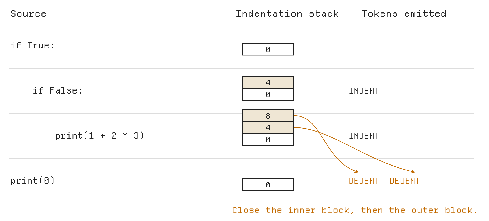
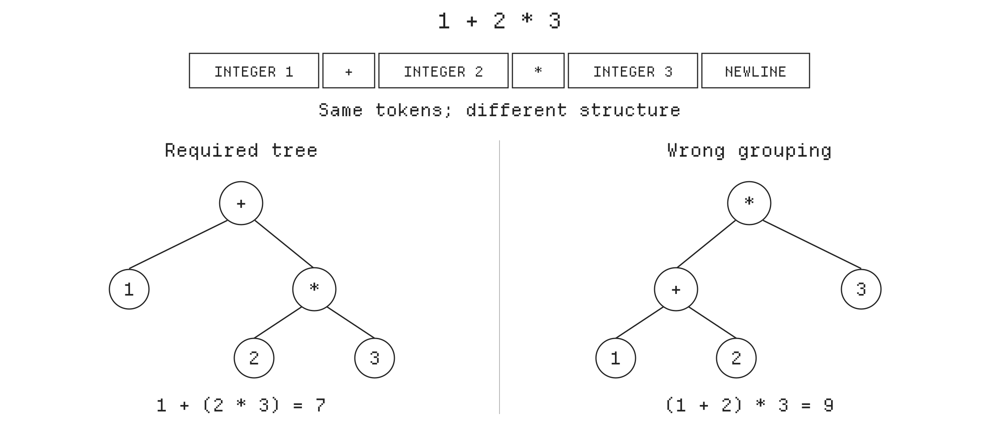

# PA2: Your Own Lexer and Parser

*How does text become a tree?*

**Due: Wednesday, October 21, 11:59 pm (Pacific).** Released Friday, October 9.

**What to do:** complete **Exercises 1 to 4** in `compiler/lexer.py` and `compiler/parser.py`, and write **three tests** of your own. Submit your AI sessions, a design document you write yourself in `docs/pa2-design.md`, or both. See Section 8 for submission and grading.

**Lectures:** Lexing (10/12), Parsing I (10/14). **Midterm 1**, on Monday, October 19, covers lexing, grammars and recursive descent: **finish your lexer and your expression parser (Exercises 1 to 3) before it.**

In PA1, Python's `ast.parse` read each program and built its tree for your code generator. In PA2 you write that part yourself: a **lexer** splits the text of the program into **tokens**, its words and symbols, and a **parser** groups the tokens into the tree. Take this program:

```python
print(1 + 2 * 3)
```

It prints `7`, because `2 * 3` is computed first. Your lexer produces the tokens `print`, `(`, `1`, `+`, `2`, `*`, `3` and `)`, followed by NEWLINE and EOF. Your parser builds a tree in which the multiplication is the right side of the addition.

**For syntactically valid ChocoPy, build the same tree and start positions as `ast.parse`. For lexical or syntax errors, report the required line and column.** Your PA1 code generator will use the trees your parser builds.

## 1 Getting started

### 1.1 Setup

Use the two commands on PA2's OneWorld page to get the starter code. The second downloads it into a new folder and opens a shell there.

**Before editing PA2, bring over your PA1 work** with `tools/carry.py`. It copies your Python modules from `compiler/`, your tests from `test/mine/` and your design documents, while keeping the new course-provided files. Run these commands in order:

```sh
curl -fsSL https://downloads.oneworldai.com/oneworld-cli/install.sh | sh
oneworld assessment join <PA2 invite code>
python3 tools/carry.py ../PA1_FOLDER
python3 tools/doctor.py
```

Replace `<PA2 invite code>` with the code from staff and `../PA1_FOLDER` with the path to your PA1 folder; put paths containing spaces in quotes. If `carry.py` reports conflicting changes, it copies nothing. Compare the listed files before deciding which version to keep. **Do your PA2 work and submit from the new PA2 folder.**

**Your code goes in `compiler/lexer.py` and `compiler/parser.py`.** Keep the entry points `tokenize(source)` and `parse(source)`; you may add helper modules directly in `compiler/`. Leave the driver, tools, emitter, runtime and `compiler/config.py` unchanged; grading uses staff copies of those files. PA2 adds:

| File | What it is |
|---|---|
| `compiler/lexer.py` | your lexer (Exercises 1 and 2) |
| `compiler/parser.py` | your parser (Exercises 3 and 4) |
| `test/mine/pa2/` | your own test programs |
| `docs/pa2-design.md` | the design document template (Section 8) |
| `tools/parsetest.py` | the PA2 test runner (Section 2) |
| `test/pa2/` | 40 syntactically valid test programs, and 38 invalid ones in `test/pa2/bad/` |

Save a program as `prog.py` to try these commands:

```sh
python3 -m compiler tokens prog.py              # your tokens
python3 -m compiler ast prog.py                 # your tree
python3 -m compiler ast --positions prog.py     # node start positions
python3 -m compiler ast --parser=python prog.py  # reference tree
python3 tools/parsetest.py test/pa2              # public PA2 tests
make test-pa2                                   # public tests and your tests
```

The starter's lexer and parser raise `NotImplementedError` until you complete them. You can test the lexer with `tokens` before the parser works. `ast --parser=python` shows the reference tree, and `tools/doctor.py` checks your environment without using your parser.

**Commands that parse programs use your parser by default from PA2 on,** including `run`, `ll` and `difftest.py`. While it is unfinished, use `python3 tools/difftest.py --parser=python test/pa1` to check your PA1 code.

### 1.2 ChocoPy in PA2

**Your parser must support the full syntax of the course's ChocoPy subset,** including functions, lists, strings, `for`, `global` and `return`. Generating code for those features comes in later assignments. The [course language specification](https://github.com/fredfeng/CS160/blob/main/chocopy/SPEC.md) defines the grammar; Sections 4 to 7 explain the rules needed for PA2.

**Python accepts some syntax that ChocoPy rejects:** chained comparisons (`1 < 2 < 3`), single-quoted strings, multiple assignment (`x = y = 1`) and declarations after statements. Your lexer or parser must reject these even when `ast.parse` accepts them.

**PA2 checks syntax, not types or execution.** An undeclared name or `1 + True` is valid input to the parser. Use `parsetest.py` for PA2: it compares trees without running programs or checking types. Use `difftest.py test/pa1` to check integration with your PA1 compiler. The `run` command still supports only PA1's features, and PA1 code-generation bugs do not affect PA2's implementation grade.

### 1.3 Your code

The excerpts below show the starter's main interfaces; `...` marks omitted code. **Fill in the TODOs in the starter files.** Build nodes with Python's `ast` classes, but write your own lexer and parser; use `ast.parse` only as a reference when testing.

**The lexer**, `tokenize` in `compiler/lexer.py`, returns a list of tokens for the whole program. The file supplies the `KEYWORDS` set and the `Token` class:

```python
@dataclass
class Token:
    kind: str
    value: object
    line: int
    col: int

    def __str__(self):
        ...  # formats a token, for example "1:5 INTEGER 1"


def tokenize(source: str) -> list[Token]:
    """
    TODO(PA2): Add implementation
    ...
    """
    raise NotImplementedError("tokenize is not implemented.")
```

**The parser**, `Parser` in `compiler/parser.py`, receives the complete token list. The entry point is `parse(source)`, which calls `Parser(tokenize(source)).program()`. Implement `program` and add parsing methods as needed. The starter supplies `peek`, `advance` and `expect`, plus the node-building helpers `at` (Section 3.2) and `function_def` (Section 7):

```python
class Parser:
    def __init__(self, tokens: list[Token]):
        self.tokens = tokens
        self.i = 0
        # Add fields and methods as needed.

    def peek(self, ahead: int = 0) -> Token:
        ...  # look ahead without consuming a token

    def advance(self) -> Token:
        ...  # return the current token and advance

    def expect(self, kind: str) -> Token:
        ...  # consume this kind of token, or raise CompileError

    def program(self) -> ast.Module:
        """
        TODO(PA2): Add implementation
        ...
        """
        raise NotImplementedError("Parser.program is not implemented.")
```

## 2 Testing your lexer and parser

`tools/parsetest.py` checks two kinds of test:

- **Valid syntax:** the tree must match `ast.parse` in structure, field values and the start position of every statement, expression and function parameter. End positions (`end_lineno`, `end_col_offset`) are not checked.
- **Invalid syntax:** a file in a `bad/` directory must raise `CompileError` at the position specified by its `# error: line:col` comment. The wording of the error message is not checked.

For example, a parser with incorrect handling of parentheses might produce:

```text
$ python3 tools/parsetest.py test/pa2/expr_comparisons.py test/pa2/bad/stmt_assign_*.py
FAIL     test/pa2/expr_comparisons.py
         Compare should start at 18:5, yours starts at 18:6
ok       test/pa2/bad/stmt_assign_multiple_targets.py
ok       test/pa2/bad/stmt_assign_to_call.py
FAIL     test/pa2/bad/stmt_assign_to_parenthesized_name.py
         accepted a program that must be rejected

2/4 tests passed
```

In the first failure, `t = (a < b) == t`, the outer comparison starts at `(`, column 5, rather than at `a`, column 6. In the second, the parser incorrectly accepts `(x) = 1`. **Columns in test output count from 1.** A `no position` result means the node is missing a start position; `bad test:` means the test file needs correction.

To see a difference in full, compare the two trees yourself:

```sh
python3 -m compiler ast prog.py > mine.txt
python3 -m compiler ast --parser=python prog.py > python.txt
diff mine.txt python.txt        # no output: the trees are the same
```

**Put your tests in `test/mine/pa2/`.** Valid tests must follow ChocoPy syntax and be accepted by `ast.parse`; they need not run successfully. Put lexical or syntax error tests in the `bad/` subdirectory, with a `# error: line:col` comment. Count lines from the top of the file, including comments and blank lines. For example, `test/mine/pa2/bad/comment_after_operator.py`:

```python
# error: 4:20
# The line ends after its comment, so the missing number is reported at column 20.
x: int = 1
x = x +   # add one
```

For a valid test, explain the expected tokens or tree in comments. PA1's runtime directives, such as `# expect-exit:`, do not specify parser results. Section 8 describes the three tests to submit.

`make test-pa2` runs the 78 public tests and your tests. To investigate a failure, run that file directly with `tokens`, `ast` or `ast --positions`. Compare positions with `ast --parser=python --positions`. If you add debugging prints, send them to standard error with `print(message, file=sys.stderr)` after `import sys`, so they do not mix with the command's output.

## 3 Background

### 3.1 Tokens

A `Token` has four fields:

- **`kind`:** `NAME`, `INTEGER`, `STRING`, a keyword or symbol such as `if` or `<=`, or a line token: `NEWLINE`, `INDENT`, `DEDENT`, `EOF`.
- **`value`:** the name, integer or decoded string; `None` for other kinds.
- **`line`:** the starting line, counting from 1.
- **`col`:** the starting column, counting from 0.

For example, `Token("NAME", "x", 1, 0)` represents `x` at the start of line 1. The `tokens` command displays columns counting from 1 and omits values that are `None`:

```text
$ cat prog.py
x = 1 + 2
$ python3 -m compiler tokens prog.py
1:1 NAME 'x'
1:3 =
1:5 INTEGER 1
1:7 +
1:9 INTEGER 2
1:10 NEWLINE
2:1 EOF
```

### 3.2 Trees and positions

The tree is made of the node classes of Python's `ast` module, as in PA1. `ctx=Store()` marks a name being assigned, and `ctx=Load()` a name being read:

```text
$ python3 -m compiler ast prog.py
Module(
  body=[
    Assign(
      targets=[
        Name(id='x', ctx=Store())],
      value=BinOp(
        left=Constant(value=1),
        op=Add(),
        right=Constant(value=2)))],
  type_ignores=[])
```

**Statements, expressions and function parameters need start positions:** `lineno` counts lines from 1, and `col_offset` counts columns from 0. The normal tree display omits positions. Use `ast --positions` to see statement and expression positions, displayed with columns counting from 1:

```text
$ python3 -m compiler ast --positions prog.py
Assign 1:1
  Name 1:1
  BinOp 1:5
    Constant 1:5
    Constant 1:9
```

Parameters (`ast.arg`) are checked by `parsetest` but are not listed by `ast --positions`. Build operators as instances such as `ast.Add()`. For names use `id="x"`; for constants use `value=5`.

Set positions with `at`, for example `at(ast.Name(id=token.value, ctx=ast.Load()), token.line, token.col)`. The tools supply defaults for omitted list fields (`[]`), optional fields (`None`) and `ctx` (`Load()`). You must supply required values, including `value=None` for a `None` literal, **`ctx=Store()` for assignment targets and `simple=1` for declarations**, as well as all start positions. Use the supplied `function_def` helper to construct function nodes across Python versions.

### 3.3 Errors

**Report an error by raising `CompileError(line, col, message)`** from `compiler/errors.py`, where **`col` counts from 1**: for a token, it is `token.col + 1`. The compiler prints it as `prog.py:1:5: message`. Only the position is tested, so word your messages as you like. Since the lexer reads the whole file first, a lexical error is reported even when a syntax error comes before it.

## 4 Tokens

**At each position, the lexer takes the longest token it can:** `classic` is one name although it begins with the keyword `class`, and `<=` is one token while `< =` is two.

- **Spaces and tabs separate tokens** and make none. **`#` starts a comment,** which runs to the end of the line, unless it is inside a string.
- **A name** starts with an ASCII letter or `_`, followed by ASCII letters, digits or `_`. A word in the supplied **`KEYWORDS`** set is a keyword, with the word itself as its kind. Use this fixed, case-sensitive set of 35 words, including reserved words such as `class`, `import` and `lambda`. Words outside it, including `match`, `case`, `type`, `_`, `int`, `print` and `len`, are names.
- **An integer** is `0`, or a sequence of ASCII digits starting with `1` through `9`, with a value **at most `2147483647`**. Read a whole run of digits before checking it: `007` is an error, not three tokens. **A minus sign is a separate token:** `-5` produces `-` and `5`. Thus `-2147483648` is rejected at its first digit, `2`, because the integer token exceeds the limit.
- **A string** uses double quotes and stays on one source line. Unescaped characters must be ASCII 32 through 126. **The supported escapes are `\"`, `\n`, `\t` and `\\`; decode them in the token's value.** For example, `"a\\b"` holds three characters. Write tabs and newlines as escapes, not literal source characters.
- **The operators and delimiters** are `+ - * // % < > <= >= == != = ( ) [ ] , : ->`.
- **Any other character is an error,** such as `!` alone, `'`, `.` or `;`. **Report a lexical error at that character, at the first digit of a bad integer, or at the opening quote of a bad string,** whatever is wrong inside it.
- **`col` counts characters,** a tab being one character.

**Example 4.1.** Names, operators and comments:

```python
classic: int = 42
print(classic//2 != -1)  # prints True
```

```text
$ python3 -m compiler tokens prog.py
1:1 NAME 'classic'
1:8 :
1:10 NAME 'int'
1:14 =
1:16 INTEGER 42
1:18 NEWLINE
2:1 NAME 'print'
2:6 (
2:7 NAME 'classic'
2:14 //
2:16 INTEGER 2
2:18 !=
2:21 -
2:22 INTEGER 1
2:23 )
2:39 NEWLINE
3:1 EOF
```

`classic//2` has no spaces but is three tokens, and `-1` is two. The comment makes no token. Section 5 explains NEWLINE and EOF.

**Example 4.2.** Strings. The `tokens` command prints a value as Python writes it, so one backslash appears as `\\`:

```text
$ cat prog.py
print("a\\b" + "say \"hi\"\n" + "# not a comment")
$ python3 -m compiler tokens prog.py
1:1 NAME 'print'
1:6 (
1:7 STRING 'a\\b'
1:14 +
1:16 STRING 'say "hi"\n'
1:31 +
1:33 STRING '# not a comment'
1:50 )
1:51 NEWLINE
2:1 EOF
```

The first string holds `a`, a backslash and `b`; the second ends with a newline character. A string token starts at its opening quote.

**Example 4.3.** Errors. Each row is a one-line `prog.py` and what `python3 -m compiler tokens prog.py` prints:

| Line | Output |
|---|---|
| `x = 007` | `prog.py:1:5: an integer literal may not start with 0` |
| `x = 2147483648` | `prog.py:1:5: integer literal is larger than 2147483647` |
| `print('hi')` | `prog.py:1:7: unexpected character "'"` |
| `print(!b)` | `prog.py:1:7: unexpected character '!'` |
| `print("bell\a")` | `prog.py:1:7: unknown escape sequence \a` |
| `print("oops)` | `prog.py:1:7: unterminated string literal` |

> **Exercise 1** (15 points). In `tokenize`, turn the text of each line into tokens: names and keywords, integers, strings with their escapes, and operators and delimiters. Skip spaces, tabs and comments, and report lexical errors where this section says.
>
> **Check:** save each program from Examples 4.1 and 4.2 as `prog.py` and run `python3 -m compiler tokens prog.py`. Match the listed tokens except NEWLINE and EOF, which you add in Exercise 2. Of the nine tests run by `python3 tools/parsetest.py test/pa2/bad/tokens_*.py`, the seven lexical error tests should pass now. The two reserved-keyword tests need the parser and should pass after Exercise 4.

## 5 Lines and indentation

A block, such as the body of an `if`, is the lines indented under it. The lexer describes the lines with four kinds of tokens, so that the parser never counts spaces: **NEWLINE** ends a line; **INDENT** starts a block, on a line indented more than the one before; **DEDENT** ends a block, on a line indented less, and **a line that ends two blocks gets two DEDENTs**; **EOF** ends the file.

- **A line that is blank or holds only a comment makes no tokens at all,** however it is indented.
- **Every other line ends with a NEWLINE, located just past its last character (before the line break),** trailing spaces and comment included. **Every line break ends a line, even inside `( )` or `[ ]`:** ChocoPy never joins lines, so a list written over two lines is an error.
- A line's **width** is the size of its indentation. A space counts 1, and **a tab moves to the next multiple of 8:** from 0 or 5 to 8, from 8 to 16.
- **The indentation stack** starts at `[0]`. Before emitting a code line's tokens, compare its width with the top. For an increase, push the width and emit INDENT. For a decrease, pop widths and emit one DEDENT per pop until the width matches. **A dedent to a width not on the stack is an error.** Equal widths need no INDENT or DEDENT.
- **An INDENT, a DEDENT or an indentation error is located at the first character of its line that is not a space or tab.** Columns count characters, not widths: a line indented by one tab has width 8, but its INDENT is at column 2.
- **At the end of the input,** emit the last code line's NEWLINE even if it has no final line break. Then emit one DEDENT for each width above 0 left on the stack, followed by EOF. **These DEDENTs and EOF are at column 1 of the line after the last.** An empty file gives just `1:1 EOF`. Blank and comment-only lines count toward the line number but never produce NEWLINE. Treat LF, CRLF and CR as line breaks, with CRLF counting once.
- A line indented more where no block starts still gets an INDENT; the parser rejects it (Section 7).



**Figure 1.** The program of Example 5.1 and its indentation stack. Before `print(0)`, the lexer closes two blocks and makes two DEDENTs.

**Example 5.1.** Two blocks end at once. This program prints `0`:

```python
if True:
    if False:
        print(1 + 2 * 3)
print(0)
```

```text
$ python3 -m compiler tokens prog.py
1:1 if
1:4 True
1:8 :
1:9 NEWLINE
2:5 INDENT
2:5 if
2:8 False
2:13 :
2:14 NEWLINE
3:9 INDENT
3:9 NAME 'print'
3:14 (
3:15 INTEGER 1
3:17 +
3:19 INTEGER 2
3:21 *
3:23 INTEGER 3
3:24 )
3:25 NEWLINE
4:1 DEDENT
4:1 DEDENT
4:1 NAME 'print'
4:6 (
4:7 INTEGER 0
4:8 )
4:9 NEWLINE
5:1 EOF
```

Lines 2 and 3 push the widths 4 and 8. Line 4, of width 0, pops both.

**Example 5.2.** Blank lines, comments and a missing final line break. In the `cat -et` display, `$` marks a line break; the last line has none:

```text
$ cat -et prog.py
x: int = 0$
while x < 3:$
  # a comment at any width is ignored$
$
    x = x + 1
```

```text
$ python3 -m compiler tokens prog.py
1:1 NAME 'x'
1:2 :
1:4 NAME 'int'
1:8 =
1:10 INTEGER 0
1:11 NEWLINE
2:1 while
2:7 NAME 'x'
2:9 <
2:11 INTEGER 3
2:12 :
2:13 NEWLINE
5:5 INDENT
5:5 NAME 'x'
5:7 =
5:9 NAME 'x'
5:11 +
5:13 INTEGER 1
5:14 NEWLINE
6:1 DEDENT
6:1 EOF
```

Lines 3 and 4 produce no tokens and do not change the indentation stack. Line 5 gets a NEWLINE despite the missing line break. The final DEDENT and EOF are on line 6.

> **Exercise 2** (15 points). Extend `tokenize` to emit NEWLINE, INDENT, DEDENT and EOF. Report an indentation error when a dedent does not match a width on the stack.
>
> **Check:** for each program in Examples 4.1, 4.2, 5.1 and 5.2, `python3 -m compiler tokens prog.py` must match the full token listing. Run `python3 tools/parsetest.py test/pa2/bad/indent_dedent_mismatch.py test/pa2/bad/indent_tab_width.py`; both tests should pass. Run the remaining indentation, line and program tests after Exercise 4.

## 6 Expressions

A **recursive-descent parser** uses methods for constructs such as expressions and statements. Each method examines the next token, chooses a grammar rule, consumes tokens and calls other methods for nested constructs. For expressions, operator precedence determines the tree. Consider two possible groupings of `1 + 2 * 3`:



**Figure 2.** ChocoPy requires the left tree: `*` is grouped before `+`.

**Precedence** determines which operators bind more tightly. The table runs from lowest precedence (level 1) to highest (level 9):

| Level | Expression | Node |
|---|---|---|
| 1 | `a if c else b` | `IfExp(test=c, body=a, orelse=b)` |
| 2 | `a or b or c` | `BoolOp(op=Or(), values=[a, b, c])` |
| 3 | `a and b and c` | `BoolOp` with `And()` |
| 4 | `not a` | `UnaryOp(op=Not(), operand=a)` |
| 5 | `a < b`, and `==` `!=` `<=` `>` `>=` `is` | `Compare(left=a, ops=[Lt()], comparators=[b])`, with `Eq()`, `NotEq()`, `LtE()`, `Gt()`, `GtE()`, `Is()` |
| 6 | `a + b`, `a - b` | `BinOp(left=a, op=Add(), right=b)`, with `Sub()` |
| 7 | `a * b`, `a // b`, `a % b` | `BinOp` with `Mult()`, `FloorDiv()`, `Mod()` |
| 8 | `-a` | `UnaryOp(op=USub(), operand=a)` |
| 9 | `a[i]` | `Subscript(value=a, slice=i, ctx=Load())` |
| 9 | `f(a, b)` | `Call(func=Name(id='f', ctx=Load()), args=[a, b], keywords=[])` |
| | `42`, `"hi"`, `True`, `False`, `None` | `Constant` with the literal's value |
| | `x` | `Name(id='x', ctx=Load())` |
| | `[a, b]` | `List(elts=[a, b], ctx=Load())` |
| | `(a)` | the node of `a`: parentheses make no node |

- **Associativity** determines grouping within a precedence level. **Levels 6, 7 and 9 group to the left:** `8 - 3 - 1` is `(8 - 3) - 1`, and `xss[0][1]` indexes `xss[0]`. **Conditional expressions group to the right:** in `a if c else b if d else e`, the second conditional is the `orelse` of the first. A conditional used as the condition must be parenthesized.
- **A run of `and`, or of `or`, is one `BoolOp`:** `a and b and c` has three values. Parentheses end a run.
- **Comparisons do not chain:** `1 < 2 < 3` is an error at the second `<`. With parentheses, a comparison can compare comparisons: `(a < b) == c`.
- **`not` has lower precedence than comparisons:** `not a == b` is `not (a == b)`, and `True == not False` is an error at `not`. **Unary `-` has higher precedence than `*`:** `-2 * 3` is `(-2) * 3`.
- **Only a bare name can be called:** `f(1)(2)` is an error at the second `(`, and `(f)(1)` at the `(` after `(f)`. **Calls and lists have no trailing comma:** `[1, 2,]` is an error at the `]`.
- **An expression alone on a line is a statement,** `Expr(value=e)`.

**Positions.** A `Constant` or `Name` starts at its token, a `List` at `[`, and a `UnaryOp` at its operator. Other expressions start where their first part's source text starts. **Track opening parentheses even though they create no AST node:** in `(1 + 2) * 3`, the product starts at `(`, while the inner sum starts at `1`. An expression statement (`Expr`) starts at the beginning of its source text, including any opening parenthesis. Example 6.3 shows these positions.

**Report syntax errors at the first token that cannot continue the program.** In `x = x +`, that token is the NEWLINE after `+`. The supplied `expect` method reports errors at the current token.

**Example 6.1.** Precedence and associativity:

```text
$ cat prog.py
1 + 2 * 3 - 4
$ python3 -m compiler ast prog.py
Module(
  body=[
    Expr(
      value=BinOp(
        left=BinOp(
          left=Constant(value=1),
          op=Add(),
          right=BinOp(
            left=Constant(value=2),
            op=Mult(),
            right=Constant(value=3))),
        op=Sub(),
        right=Constant(value=4)))],
  type_ignores=[])
```

**Example 6.2.** `True and False and True` is one `BoolOp` with three values; parentheses keep a `BoolOp` inside another:

```text
$ cat prog.py
True and (False and True)
$ python3 -m compiler ast prog.py
Module(
  body=[
    Expr(
      value=BoolOp(
        op=And(),
        values=[
          Constant(value=True),
          BoolOp(
            op=And(),
            values=[
              Constant(value=False),
              Constant(value=True)])]))],
  type_ignores=[])
```

**Example 6.3.** Positions and parentheses:

```text
$ cat prog.py
(1 + 2) * 3
-(4)
$ python3 -m compiler ast --positions prog.py
Expr 1:1
  BinOp 1:1
    BinOp 1:2
      Constant 1:2
      Constant 1:6
    Constant 1:11
Expr 2:1
  UnaryOp 2:1
    Constant 2:3
```

**Example 6.4.** Syntax errors. Each row shows a one-line `prog.py` and a sample diagnostic from `python3 -m compiler ast prog.py`. Match the error positions; your message wording may differ. Python accepts the first, second and fourth programs, but ChocoPy rejects them:

| Line | Output |
|---|---|
| `1 < 2 < 3` | `prog.py:1:7: expected the end of the comparison (comparisons do not chain), found '<'` |
| `f(1)(2)` | `prog.py:1:5: expected the end of the line, found '('` |
| `True == not False` | `prog.py:1:9: expected an expression, found 'not'` |
| `[1, 2,]` | `prog.py:1:7: expected an expression, found ']'` |
| `1 +   # add one` | `prog.py:1:16: expected an expression, found the end of the line` |

> **Exercise 3** (15 points). In `compiler/parser.py`, parse expressions into the trees and start positions shown above. Reject invalid expressions at the specified positions. For now, let `program` accept only expression statements, one per line; Exercise 4 adds other statements.
>
> **Check:** create `scratch/expr.py` containing the four source expressions from Examples 6.1 to 6.3, one per line. Run `python3 tools/parsetest.py scratch/expr.py test/pa2/bad/expr_not_after_comparison.py`; both tests should pass. After Exercise 4, also run `python3 tools/parsetest.py test/pa2/expr_*.py test/pa2/bad/expr_*.py`.

## 7 Statements, declarations and functions

- **A program** begins with variable declarations and function definitions in any order, followed by statements and EOF. **A `NAME` followed by `:` starts a variable declaration;** `def` starts a function definition. An empty program is valid.
- **A variable declaration** has the form `name: type = literal`, followed by NEWLINE. Here a literal is an integer, a string, `True`, `False` or `None`; `-5`, `[]` and `1 + 2` are not allowed as declaration initializers. A type name becomes a `Name` node; `[type]` becomes a `List` containing one type node. The parser accepts any `NAME` as a type name; checking whether the type exists comes later.
- **A function definition** starts with `def name(parameters)`, an optional `-> type`, and `:`. Parameters have the form `name: type`, separated by commas with no trailing comma. The body starts with NEWLINE and INDENT, contains any `global` and variable declarations followed by **at least one statement**, and ends with DEDENT. **Functions do not nest.**
- **A `global` declaration** names one variable and ends with NEWLINE. It is allowed only at the start of a function body, before statements; it may be interleaved with variable declarations.
- **A block** is NEWLINE, INDENT, one or more statements, and DEDENT. **An `elif` becomes an `If` alone in the `orelse` of the `If` before it;** an `else` block is the `orelse`.
- **An assignment has one target:** a name or an indexed expression such as `xs[i]` or `f(x)[0]`. The whole target cannot be parenthesized. **Only its outermost node gets `ctx=Store()`.** Thus `(xs)[0] = 1` is allowed, but `(xs[0]) = 1` is not.
- Assignments, expression statements, `pass` and `return` end with NEWLINE.

| Source | Node |
|---|---|
| `x: int = 5` | `AnnAssign(target=Name(id='x', ctx=Store()), annotation=Name(id='int', ctx=Load()), value=Constant(value=5), simple=1)` |
| `def f(n: int) -> int:` | `function_def('f', params, body, returns, line, col)`; `params` contains `arg(arg='n', annotation=Name(id='int', ctx=Load()))`, and `returns` is the return type node or `None` if `->` is omitted |
| `global x` | `Global(names=['x'])` |
| `x = e`, `xs[i] = e` | `Assign(targets=[target], value=e)` |
| `pass`, `return`, `return e` | `Pass()`, `Return()`, `Return(value=e)` |
| `if c:` | `If(test=c, body=[...], orelse=[...])` |
| `while c:` | `While(test=c, body=[...], orelse=[])` |
| `for x in e:` | `For(target=Name(id='x', ctx=Store()), iter=e, body=[...], orelse=[])` |

**A statement starts at its first token.** This is the keyword for `if`, `while`, `for`, `def`, `return`, `pass` and `global`, or the name for a variable declaration. The `If` node for an `elif` starts at `elif`. Assignments and expression statements start at their first expression's source text; each parameter starts at its name.

Report syntax errors at the first token that cannot continue the program. For example, a declaration `x: int = 1` after `print(0)` fails at `:`: `x` can start a statement, but `:` cannot continue it.

**Example 7.1.** A declaration and two assignments. In `xs[0] = ...`, only the `Subscript` is stored to; the `xs` inside it is read:

```python
xs: [int] = None
xs = [1, 2]
xs[0] = xs[1] + 1
```

```text
$ python3 -m compiler ast prog.py
Module(
  body=[
    AnnAssign(
      target=Name(id='xs', ctx=Store()),
      annotation=List(
        elts=[
          Name(id='int', ctx=Load())],
        ctx=Load()),
      value=Constant(value=None),
      simple=1),
    Assign(
      targets=[
        Name(id='xs', ctx=Store())],
      value=List(
        elts=[
          Constant(value=1),
          Constant(value=2)],
        ctx=Load())),
    Assign(
      targets=[
        Subscript(
          value=Name(id='xs', ctx=Load()),
          slice=Constant(value=0),
          ctx=Store())],
      value=BinOp(
        left=Subscript(
          value=Name(id='xs', ctx=Load()),
          slice=Constant(value=1),
          ctx=Load()),
        op=Add(),
        right=Constant(value=1)))],
  type_ignores=[])
```

**Example 7.2.** `elif` and `else`:

```python
x: int = 0
if x < 0:
    print(0)
elif x == 0:
    pass
else:
    x = 1
```

```text
$ python3 -m compiler ast --positions prog.py
AnnAssign 1:1
  Name 1:1
  Name 1:4
  Constant 1:10
If 2:1
  Compare 2:4
    Name 2:4
    Constant 2:8
  Expr 3:5
    Call 3:5
      Name 3:5
      Constant 3:11
  If 4:1
    Compare 4:6
      Name 4:6
      Constant 4:11
    Pass 5:5
    Assign 7:5
      Name 7:5
      Constant 7:9
```

The `If` at 4:1 is the only statement in the `orelse` of the first `If`; its `body` is the `pass`, and its `orelse` the `else` block.

**Example 7.3.** ChocoPy syntax errors that Python accepts. Each row shows a `prog.py` and a sample diagnostic from `python3 -m compiler ast prog.py`:

| Program | Output |
|---|---|
| `print(0)`, then `x: int = 1` | `prog.py:2:2: expected the end of the line, found ':'` |
| `x = y = 1` | `prog.py:1:7: expected the end of the line, found '='` |
| `(x) = 1` | `prog.py:1:5: expected the end of the line, found '='` |
| `if x == 1: pass` | `prog.py:1:12: expected the end of the line, found 'pass'` |
| `x: int = -5` | `prog.py:1:10: expected a literal, found '-'` |
| `def f() -> None:`, then `    pass` | `prog.py:1:12: expected a type, found 'None'` |

A missing block is an error at the token where INDENT was expected. Unexpected indentation is an error at INDENT. In the first test below, the parser finds DEDENT after an `if` header; in the second, line 6 is unexpectedly indented:

```text
$ python3 -m compiler ast test/pa2/bad/indent_empty_block.py
test/pa2/bad/indent_empty_block.py:7:5: expected an indented block, found the end of the block
$ python3 -m compiler ast test/pa2/bad/indent_unexpected.py
test/pa2/bad/indent_unexpected.py:6:9: expected an expression, found an indented block
```

> **Exercise 4** (15 points). Extend `program` to parse declarations, functions, statements and blocks. Match `ast.parse` trees and start positions, and reject syntax errors at the positions described above.
>
> **Check:** `make test-pa2` must pass: every test in `test/pa2`, and your three tests. `python3 tools/difftest.py test/pa1` must give the same results as with `--parser=python`.

## 8 Submitting your work

Submit three components:

- **Code:** complete Exercises 1 to 4.
- **Three original tests** in `test/mine/pa2/`: one for indentation, one for expression-tree shape and one for a lexical or syntax error. Put any rejection test in `test/mine/pa2/bad/` with a `# error: line:col` comment. Explain each test's expected result and the mistake it catches. Check it against a copy of your code containing that mistake. The tests must also pass on the staff parser. You may test rules already covered by public tests, but write your own programs.
- **Sessions, a design document, or both:** submit Claude Code or Codex sessions started in your PA2 folder, or write about one page using the headings in `docs/pa2-design.md`. AI use is optional. The design document must be written without AI; an AI-written document receives 0.

**Submit from your PA2 folder:**

```sh
oneworld assessment status
oneworld assessment submit
```

Check that `status` names PA2 before running `submit`. Submission includes your changes to the starter, including committed and uncommitted files and your carried-over PA1 code; Git-ignored files are excluded. If submitting sessions, select all relevant PA2 sessions when prompted. A design document needs no accompanying session. Keep the submission receipt as confirmation of upload. No video or ZIP is required.

**Grading.** PA2 is worth 5% of your course grade, with 100 assignment points:

- **Implementation: 60 points**, 15 per exercise, checked with public and additional staff tests.
- **Tests: 20 points**, for catching distinct mistakes (8), correct expected results and explanations (6), and reproducible checks with accurate interpretation (6).
- **Sessions or design document: 20 points.** Each is graded independently: Excellent (20), Good (15), Fair (10) or Poor (5). If you submit both, the higher score counts; if neither, this component receives 0.

For sessions, staff evaluate how your prompts address design decisions and request checks. For a design document, explain those decisions and how you tested them. Focus on indentation, precedence, tree positions and error handling. Session length and prompt count do not determine the score.

## 9 Practice

> **Exercise 5** (not graded). Start with Example 5.1. Add `x: int = 0` at the top and `x = 10 - 2 * 3` after the inner `if` block, indented four spaces so it remains inside the outer `if`. Save the result as `prog.py`. Predict every INDENT and DEDENT token and its position, and sketch the tree of `10 - 2 * 3`. Compare with `python3 -m compiler tokens prog.py` and `python3 -m compiler ast prog.py`.

> **Exercise 6** (practice for Midterm 1). Consider `E -> E + T | T`, `T -> T * F | F`, `F -> ( E ) | id`; `|` separates alternatives. The rules for `E` and `T` are **left recursive**: an alternative begins with the symbol being defined. Why does this cause a problem for recursive descent? Remove the left recursion and write parsing functions for `E`, `T` and `F`. Then write a five-line program with two nested blocks and list all its tokens. FIRST/FOLLOW sets and LR parsing belong to Midterm 2.
